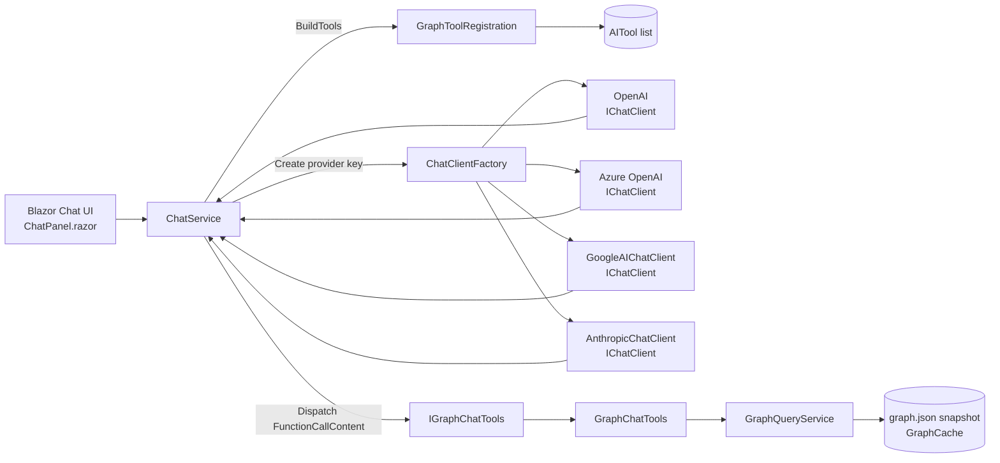
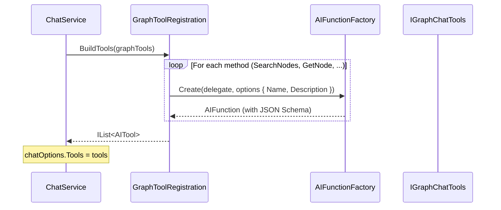
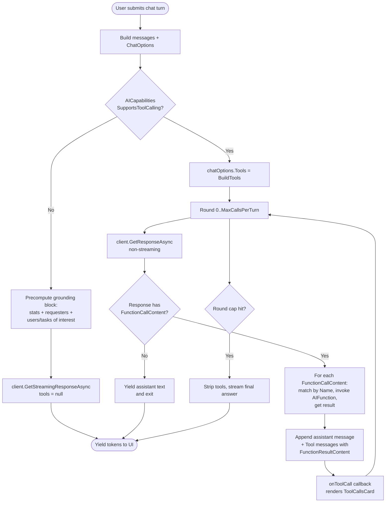
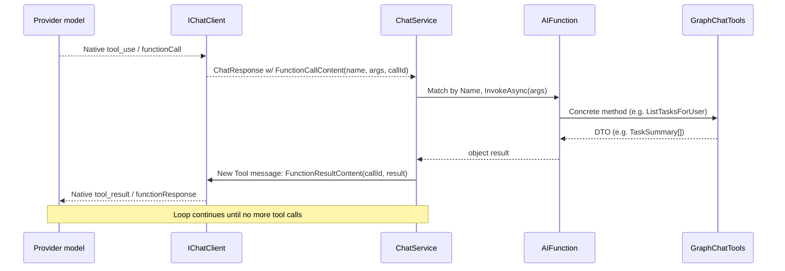
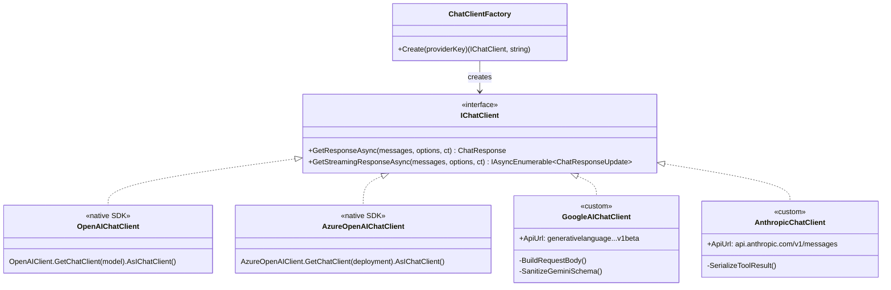
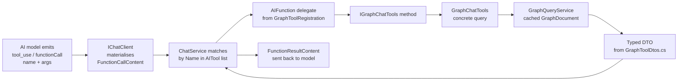
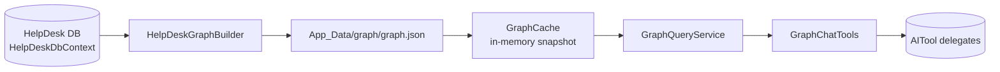
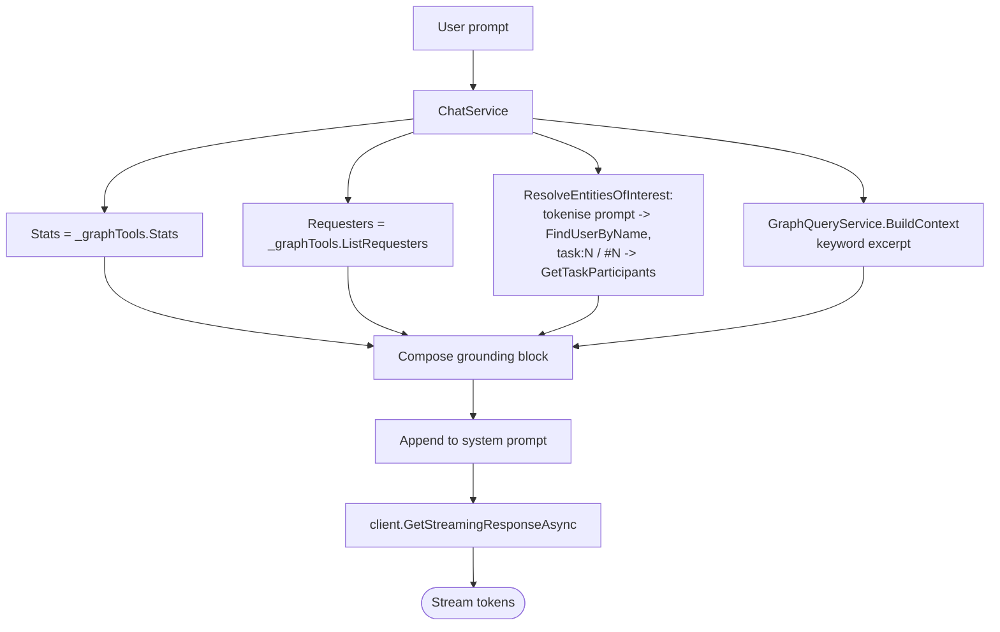
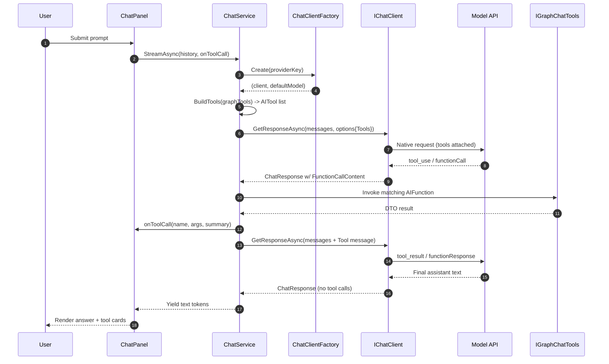

# AI Provider Tools — Implementation Plan & Reference

This document describes how the **chat tool / function-calling** surface is built and
wired for each AI provider supported by `AdefHelpDeskGraphExplorer`
(OpenAI, Azure OpenAI, Google Gemini, Anthropic Claude), the per-provider
implementation details, and how the abstract tool definitions are mapped to the
concrete read-only methods on `IGraphChatTools` that query the cached help-desk
knowledge graph.

It is intended to be detailed enough that a developer can extend the tool set,
add a new provider, or debug a tool-calling round end-to-end using only this
document plus the source tree.

---

## 1. High-Level Architecture

The chat stack has three independent layers:

1. **Tool surface** — A single provider-agnostic list of `AITool` instances
   built from `IGraphChatTools` by `GraphToolRegistration.BuildTools(...)`.
2. **Provider abstraction** — Every provider is exposed as a
   `Microsoft.Extensions.AI.IChatClient`. The native OpenAI / Azure OpenAI SDKs
   already implement `IChatClient`; Google and Anthropic have hand-rolled
   `IChatClient` implementations that translate `Microsoft.Extensions.AI` types
   to the provider's wire format.
3. **Orchestration** — `ChatService` runs the tool-call loop. It is identical
   for every provider because the loop is expressed in `Microsoft.Extensions.AI`
   primitives (`FunctionCallContent`, `FunctionResultContent`).



### Key source files

| Concern | File |
| --- | --- |
| Tool definitions (names, descriptions, parameter schemas) | [Services/AI/GraphTools/GraphToolRegistration.cs](../Services/AI/GraphTools/GraphToolRegistration.cs) |
| Tool interface contract | [Services/AI/GraphTools/IGraphChatTools.cs](../Services/AI/GraphTools/IGraphChatTools.cs) |
| Tool implementations (the functions the AI actually invokes) | [Services/AI/GraphTools/GraphChatTools.cs](../Services/AI/GraphTools/GraphChatTools.cs) |
| Tool DTOs (return shapes) | [Services/AI/GraphTools/GraphToolDtos.cs](../Services/AI/GraphTools/GraphToolDtos.cs) |
| Provider client factory | [Services/AI/ChatClientFactory.cs](../Services/AI/ChatClientFactory.cs) |
| Provider/model capability rules | [Services/AI/AICapabilities.cs](../Services/AI/AICapabilities.cs) |
| Orchestrator + tool-call loop | [Services/AI/ChatService.cs](../Services/AI/ChatService.cs) |
| Anthropic provider impl | [Services/AI/AnthropicChatClient.cs](../Services/AI/AnthropicChatClient.cs) |
| Google Gemini provider impl | [Services/AI/GoogleAIChatClient.cs](../Services/AI/GoogleAIChatClient.cs) |

---

## 2. How Tools Are Created (Provider-Agnostic)

Tool creation is **identical for every provider**. The provider abstraction
boundary is `Microsoft.Extensions.AI.AIFunction`. Each tool is a delegate
wrapped by `AIFunctionFactory.Create(...)`, which uses reflection over the
delegate's parameters and `[Description]` attributes to produce:

- A canonical **name** (`SearchNodes`, `GetNode`, …).
- A **description** sent to the model.
- A **JSON Schema** for the parameter object (built automatically from the C#
  parameter list and `[Description]` attributes).

The factory returns an `AIFunction` (subtype of `AITool`). All tools are
collected into an `IList<AITool>` and assigned to `ChatOptions.Tools` once per
chat turn:

```csharp
var tools = GraphToolRegistration.BuildTools(_graphTools);
chatOptions.Tools = tools;
```

Whether those tools reach the wire — and how — is the responsibility of the
provider-specific `IChatClient`. See section 4.

### 2.1 Tool registration flow



### 2.2 What a tool definition looks like

```csharp
AIFunctionFactory.Create(
    ([Description("Free-text query — names, words, IDs.")] string query,
     [Description("Optional node type filter: Task, User, Category, Comment, TaskDetail.")] string? type,
     [Description("Max results, 1-100. Default 20.")] int max)
        => t.SearchNodes(query, type, max),
    new AIFunctionFactoryOptions
    {
        Name = "SearchNodes",
        Description = "Search graph nodes by keyword. Returns enriched node summaries ..."
    });
```

The delegate body is the **mapping** — it is the single line of code that
connects the abstract tool to a concrete `IGraphChatTools` method.

### 2.3 The tool list

| Tool name | Backing method | Purpose |
| --- | --- | --- |
| `SearchNodes` | `IGraphChatTools.SearchNodes(query, type, max)` | Keyword search across all graph nodes with per-type enriched fields. |
| `GetNode` | `IGraphChatTools.GetNode(id)` | Full payload + 1-hop neighbour preview for a single node. |
| `GetNeighbors` | `IGraphChatTools.GetNeighbors(id, edgeType, max)` | 1-hop neighbours, optionally filtered by edge type. |
| `ListTasksForUser` | `IGraphChatTools.ListTasksForUser(userId, role, status, max)` | Capped list of tasks the user participated in. |
| `CountTasksForUser` | `IGraphChatTools.CountTasksForUser(userId, role)` | True (uncapped) count for the same predicate. |
| `GetUserActivity` | `IGraphChatTools.GetUserActivity(userId, maxIdsPerList)` | Counts + four task-id arrays for one user. |
| `GetTaskParticipants` | `IGraphChatTools.GetTaskParticipants(taskId)` | All users connected to a task with their roles. |
| `ListCommentsForTask` | `IGraphChatTools.ListCommentsForTask(taskId, max)` | Ordered comments/work entries for a task. |
| `ListTasksInCategory` | `IGraphChatTools.ListTasksInCategory(categoryId, includeDescendants, max)` | Capped tasks in a category subtree. |
| `GetCategoryRollup` | `IGraphChatTools.GetCategoryRollup(categoryId, includeDescendants)` | Aggregate counts (overall + by status/priority) for a category. |
| `FindUserByName` | `IGraphChatTools.FindUserByName(query, max)` | Resolve a natural-language name to `User` nodes. |
| `ListRequesters` | `IGraphChatTools.ListRequesters(nameContains, max)` | Every distinct requester (registered + unregistered), ranked. |
| `GraphStats` | `IGraphChatTools.Stats()` | Graph-wide aggregate statistics. |

See [Services/AI/GraphTools/GraphToolRegistration.cs](../Services/AI/GraphTools/GraphToolRegistration.cs)
for the canonical, up-to-date list.

---

## 3. The Tool-Call Loop (Shared Across All Providers)

`ChatService.StreamAsync` runs a hand-rolled tool-call loop. It is the same
code path for every provider — the differences are entirely encapsulated inside
each provider's `IChatClient`.



### 3.1 Loop invariants

- Tools are **only** attached if both `snapshot.Tools.Enabled` and
  `AICapabilities.SupportsToolCalling(providerKey, model)` are true.
- `MaxCallsPerTurn` (from `AIOptions.Tools.MaxCallsPerTurn`) bounds the loop;
  on overflow, a final tools-disabled streamed call closes the turn.
- The first round catches transient provider errors and **retries once without
  tools** so providers/models that mis-handle tool requests still produce text.
- The loop is provider-agnostic because it speaks only `FunctionCallContent`
  and `FunctionResultContent` — the provider client is responsible for
  translating those to/from native wire formats.

### 3.2 Dispatching a tool call



---

## 4. Per-Provider Implementation Details

Every provider plugs in at the `IChatClient` boundary. The factory
([ChatClientFactory.cs](../Services/AI/ChatClientFactory.cs)) returns
`(IChatClient, defaultModel)` for a normalised provider key.



### 4.1 OpenAI

- **Class:** `OpenAI.Chat.ChatClient` from the official `OpenAI` SDK, adapted to
  `IChatClient` via `AsIChatClient()`.
- **Construction:**
  ```csharp
  var options = new OpenAIClientOptions();
  if (!string.IsNullOrWhiteSpace(settings.Endpoint))
      options.Endpoint = new Uri(settings.Endpoint);
  var openAI = new OpenAIClient(new ApiKeyCredential(settings.ApiKey!), options);
  inner = openAI.GetChatClient(model).AsIChatClient();
  ```
- **Tools on the wire:** Native `tools` array (JSON Schema parameter
  definitions) and `tool_calls` / `tool` role messages. The SDK adapter
  translates `AIFunction` ↔ OpenAI tool definitions and
  `FunctionCallContent` ↔ `tool_calls` automatically.
- **Streaming:** Native SSE streaming used directly by `ChatService` for the
  no-tools and final-answer paths.
- **Model quirks (in `AICapabilities`):**
  - `gpt-5*`, `o1*`, `o3*`, `o4*` reject `temperature` (must omit).
- **Configured by:** `AIConfigurationService.GetProvider("OpenAI")`.

### 4.2 Azure OpenAI

- **Class:** `Azure.AI.OpenAI.AzureOpenAIClient`, adapted the same way.
- **Construction:**
  ```csharp
  var azure = new AzureOpenAIClient(
      new Uri(settings.Endpoint!),
      new AzureKeyCredential(settings.ApiKey!));
  inner = azure.GetChatClient(deploymentName).AsIChatClient();
  ```
- **Key difference vs OpenAI:** The model id is the **deployment name** on the
  Azure resource (`settings.DeploymentName`), not a catalogue model id.
- **Tools on the wire:** Same as OpenAI (Azure OpenAI is API-compatible).
- **Temperature quirks:** Same `AICapabilities.SupportsCustomTemperature`
  rules apply because the deployment hosts an OpenAI model family.

### 4.3 Google Gemini

- **Class:** Custom [`GoogleAIChatClient`](../Services/AI/GoogleAIChatClient.cs)
  (`IChatClient`).
- **Endpoint:** `https://generativelanguage.googleapis.com/v1beta/models/{model}:generateContent?key={apiKey}`.
- **Request shape (key parts):**
  - `systemInstruction.parts[].text` — concatenated system messages.
  - `contents[]` — user/assistant turns with `role` ∈ `{ "user", "model" }`.
  - `generationConfig.temperature` etc.
  - `tools[0].functionDeclarations[]` — each tool projected as
    `{ name, description, parameters }`.
- **Tool schema sanitisation:** Gemini accepts only an OpenAPI subset of JSON
  Schema. `SanitizeGeminiSchema` strips unsupported keywords from
  `AIFunction.JsonSchema` before posting. Tools with empty argument structs
  omit the `args` field — some Gemini versions reject empty Struct payloads.
- **Tool round-trip:**
  - **Model → caller:** `parts[].functionCall { name, args }` becomes
    `FunctionCallContent(callId, name, args)`. A synthetic `call_{name}_{i}`
    id is generated because Gemini does not return tool call ids.
  - **Caller → model:** `parts[].functionResponse { name, response }` on a
    `user`-role turn. The `response` must be a JSON object, so primitives /
    arrays are wrapped in `{ result: ... }` by `SerializeToolResultAsObject`.
- **Thinking models:** Gemini 2.5+/3.x attach `thoughtSignature` per
  `functionCall` part. The client stashes it on
  `FunctionCallContent.AdditionalProperties` and replays it on the next
  request — without it the API rejects the follow-up.
- **Streaming:** `GetStreamingResponseAsync` falls back to a single
  non-streamed call and replays the response as one `ChatResponseUpdate`. The
  tool loop already runs `GetResponseAsync` non-streamed, so this only affects
  the final answer rendering.

### 4.4 Anthropic Claude

- **Class:** Custom [`AnthropicChatClient`](../Services/AI/AnthropicChatClient.cs)
  (`IChatClient`).
- **Endpoint:** `https://api.anthropic.com/v1/messages`.
- **Headers:**
  - `x-api-key: {ApiKey}`
  - `anthropic-version: 2023-06-01`
  - `anthropic-dangerous-direct-browser-access: true` (server-side use here,
    kept for parity with the upstream port).
- **Request shape (key parts):**
  - `system: string` — concatenated system messages.
  - `messages[]` — `user` / `assistant` turns. Tool results are sent as a
    `user`-role message whose `content[]` contains `tool_result` blocks
    (`pendingToolResults` is flushed when the next non-tool turn arrives).
  - `tools[]` — each tool projected as
    `{ name, description, input_schema }` where `input_schema` is the
    `AIFunction.JsonSchema` deserialised as a `JsonElement`. Claude accepts
    JSON Schema directly, so no sanitisation step is required.
- **Tool round-trip:**
  - **Model → caller:** `content[].type == "tool_use"` blocks become
    `FunctionCallContent(id, name, input)`. The Anthropic-supplied `id` is
    preserved as the `CallId`.
  - **Caller → model:** `content[].type == "tool_result"` with
    `tool_use_id = callId` and a string-serialised result (`SerializeToolResult`
    JSON-encodes structured results, passes strings through).
- **Streaming:** Same fallback strategy as Gemini — non-streamed call replayed
  as a single update.
- **Model quirks:** Claude Opus 4.x and Sonnet 4.x reject explicit
  `temperature` (`AICapabilities.AnthropicSupportsTemperature`).

### 4.5 Provider feature matrix

| Capability | OpenAI | Azure OpenAI | Google Gemini | Anthropic |
| --- | --- | --- | --- | --- |
| `IChatClient` source | Native SDK adapter | Native SDK adapter | Custom HTTP client | Custom HTTP client |
| Wire-level tool calling | ✅ via SDK | ✅ via SDK | ✅ `functionDeclarations` | ✅ `tools` / `tool_use` |
| Native streaming | ✅ | ✅ | ❌ (single replay) | ❌ (single replay) |
| Tool schema needs sanitising | ❌ | ❌ | ✅ (OpenAPI subset) | ❌ |
| Tool call ids returned by provider | ✅ | ✅ | ❌ (synthesised) | ✅ |
| `temperature` restrictions | `gpt-5*`, `o*` reject | Same | n/a (passed through) | Opus/Sonnet 4.x reject |
| Model identifier | Catalogue model id | Deployment name | Catalogue model id | Catalogue model id |

---

## 5. Mapping Tools → Backing Functions

This section is the contract a developer must preserve when **adding** a tool
or **renaming** an existing one. The flow for any tool is:



The **name** in `AIFunctionFactoryOptions.Name` is the contract — it is what the
model emits and what `ChatService` matches against when dispatching.

### 5.1 Function-by-function reference

Each row below documents:

- The tool name (the name the AI emits).
- The C# signature of the delegate registered in `GraphToolRegistration`.
- The `IGraphChatTools` method invoked.
- What the function does, including which graph elements it touches.

#### `SearchNodes(query, type?, max)`

- **Method:** `NodeSummary[] SearchNodes(string query, string? type, int max)`
- **Behaviour:** Splits `query` into lowercased tokens, optionally restricts to
  `type` (`Task`, `User`, `Category`, `Comment`, `TaskDetail`), and returns
  nodes that match *all* tokens. Each `NodeSummary` is enriched with the most
  relevant per-type fields (status/priority for Tasks, email/username for
  Users, etc.) so the model rarely needs a follow-up `GetNode`.
- **Cap:** `max` is clamped to 1..`HardMaxCap (100)`; default 20.

#### `GetNode(id)`

- **Method:** `NodeDetail? GetNode(string id)`
- **Behaviour:** Returns the full `Data` dictionary of the node plus
  `OutgoingEdgeCount`, `IncomingEdgeCount`, per-`EdgeTypeCounts`, and a
  preview of up to 12 1-hop neighbours.

#### `GetNeighbors(id, edgeType?, max)`

- **Method:** `Neighbor[] GetNeighbors(string id, string? edgeType, int max)`
- **Behaviour:** Walks every edge incident to `id`, optionally filtering by
  `edgeType` (`REQUESTED_BY`, `ASSIGNED_TO`, `IN_CATEGORY`, `CHILD_OF`,
  `HAS_DETAIL`, `HAS_COMMENT`, `AUTHORED`, `AUTHORED_BY`).
- **Cap:** default 25, max 100.

#### `ListTasksForUser(userId, role?, status?, max)`

- **Method:** `TaskSummary[] ListTasksForUser(int userId, string? role, string? status, int max)`
- **Behaviour:** Returns Tasks where the user participates in `role` ∈
  `{ requested, assigned, commented, any }` (default `any`), optionally
  filtered by `status`. Each row carries denormalised counts so the model can
  answer aggregate follow-ups without further calls.
- **Cap:** default 25, max 100. **The model is instructed never to read the
  length of this list as a total** — it must call `CountTasksForUser` instead.

#### `CountTasksForUser(userId, role?)`

- **Method:** `int CountTasksForUser(int userId, string? role)`
- **Behaviour:** Uncapped true count for the same predicate as
  `ListTasksForUser`. The canonical answer for "how many tasks did X work
  on?".

#### `GetUserActivity(userId, maxIdsPerList?)`

- **Method:** `UserActivity? GetUserActivity(int userId, int maxIdsPerList = 100)`
- **Behaviour:** Single-call rollup: username, email, isSuperUser, plus the
  requested / assigned / commented / workedOn counts and matching task arrays
  (each task with id, label, status, priority, createdUtc).
- **Counts are always exact**; only the inline id arrays are subject to
  `maxIdsPerList`.

#### `GetTaskParticipants(taskId)`

- **Method:** `TaskParticipant[] GetTaskParticipants(int taskId)`
- **Behaviour:** All Users connected to the Task (any role), with their
  username, email, comment count on that task, and role flags
  (`isRequester`, `isAssignee`, `isCommenter`).

#### `ListCommentsForTask(taskId, max)`

- **Method:** `CommentSummary[] ListCommentsForTask(int taskId, int max)`
- **Behaviour:** Ordered TaskDetail / Comment children of the Task, including
  `detailType`, author id/name, text, start/stop time, and `durationMinutes`
  for Work entries.

#### `ListTasksInCategory(categoryId, includeDescendants, max)`

- **Method:** `TaskSummary[] ListTasksInCategory(int categoryId, bool includeDescendants, int max)`
- **Behaviour:** Tasks in the category subtree (walks `CHILD_OF` when
  `includeDescendants`). Same `TaskSummary` shape as `ListTasksForUser`.
- **Cap:** default 25, max 100.

#### `GetCategoryRollup(categoryId, includeDescendants)`

- **Method:** `CategoryRollup? GetCategoryRollup(int categoryId, bool includeDescendants)`
- **Behaviour:** Aggregate counts for a category: parentCategoryId, level,
  childCategoryCount, descendant category ids, direct + total task counts,
  and `ByStatus` / `ByPriority` breakdowns. Canonical answer for "how many
  tickets in X?".

#### `FindUserByName(query, max)`

- **Method:** `UserSummary[] FindUserByName(string query, int max)`
- **Behaviour:** Resolves a natural-language name / partial username / partial
  email to one or more `User` nodes. Each result includes participation
  counts so a follow-up `GetUserActivity` is usually unnecessary.

#### `ListRequesters(nameContains?, max)`

- **Method:** `RequesterSummary[] ListRequesters(string? nameContains, int max)`
- **Behaviour:** Enumerates **every** distinct requester across all Tasks,
  including unregistered requesters that appear only as a free-text
  `requesterName` on a Task (no `User` node, `isRegistered = false`).
  Registered requesters are merged onto the User row. Sorted by `taskCount`
  descending.
- **Notes:** The system prompt explicitly forces this tool for requester
  ranking questions — `SearchNodes` and `FindUserByName` miss unregistered
  requesters.

#### `GraphStats()`

- **Method:** `GraphStats Stats()`
- **Behaviour:** High-level summary — total node/edge counts, breakdowns by
  node and edge type, tasksByStatus, tasksByPriority, commentsByType, plus
  top-10 most active users (by `workedOnTaskCount`) and top-10 categories by
  task count. Always available; used unconditionally as grounding for
  providers without tool calling.

### 5.2 Where the data comes from



All tool calls are **read-only** and resolved against the
`GraphDocument` snapshot held by `GraphCache`. Re-building the graph
(`HelpDeskGraphBuilder.BuildAsync`) is a separate concern outside the tool
surface.

---

## 6. The "No Tool Calling" Fallback

If `AICapabilities.SupportsToolCalling(providerKey, model)` returns false (or
the user disables tools in Settings), `ChatService` runs a different code path:



The same `IGraphChatTools` surface is used — the only difference is that the
host (`ChatService`) calls the tools itself and serialises the results into
the system prompt, instead of letting the model decide which tools to invoke.

This guarantees feature parity for less-capable providers/models and ensures a
single source of truth for "how the AI answers help-desk graph questions".

---

## 7. Extending the System

### 7.1 Adding a new tool

1. **Add the method** to `IGraphChatTools` and implement it in
   `GraphChatTools`. Return a typed DTO (define a new record in
   `GraphToolDtos.cs` if needed).
2. **Register the delegate** in `GraphToolRegistration.BuildTools`:
   ```csharp
   AIFunctionFactory.Create(
       ([Description("...")] T1 p1, [Description("...")] T2 p2) => t.NewTool(p1, p2),
       new AIFunctionFactoryOptions {
           Name = "NewTool",
           Description = "What it does + when to call it."
       });
   ```
3. **Update the system prompts** in `ChatService.BuildSystemPrompt` if the new
   tool changes the canonical way to answer a class of question.
4. No provider-specific code changes are required — every provider client
   will pick up the new tool automatically from `ChatOptions.Tools`.

### 7.2 Adding a new provider

1. Implement `IChatClient` (model both `GetResponseAsync` and
   `GetStreamingResponseAsync`). Translate:
   - `IEnumerable<ChatMessage>` + `ChatOptions.Tools` → provider request.
   - Provider tool-call output → `FunctionCallContent` on the response.
   - `FunctionResultContent` from inbound `Tool` messages → provider's tool
     result format.
2. Add a `case` to `ChatClientFactory.Create` keyed by a normalised provider
   key.
3. Add the key to `AICapabilities.SupportsToolCalling` (and any temperature /
   capability rules).
4. Register settings (API key, endpoint, default model) in
   `AIConfigurationService` and the Settings page.

### 7.3 Common pitfalls

- **Forgetting to round-trip tool call ids.** OpenAI and Anthropic require the
  caller to echo the model's `tool_call.id` / `tool_use.id` on the result
  message. Gemini does not return ids, so the client must synthesise them.
- **Empty argument structs.** Some Gemini versions reject empty `args`
  objects; omit the field entirely when no arguments were provided.
- **JSON Schema dialect drift.** Gemini accepts only an OpenAPI subset —
  always run the schema through `SanitizeGeminiSchema` (or equivalent) before
  posting.
- **Reading capped lists as totals.** `ListTasksForUser` /
  `ListTasksInCategory` return capped arrays; the model has a system-prompt
  rule to never quote their length as a total. Preserve this when adding new
  list tools, or pair them with a matching `Count*` tool.
- **Multiple system messages.** Anthropic supports only one `system` string
  and some clients collapse duplicates. `ChatService` always merges grounding
  into a single system prompt for cross-provider parity.

---

## 8. Quick Reference Diagrams

### 8.1 Full request lifecycle (tool-calling provider)



### 8.2 Component ownership

```mermaid
flowchart TB
    subgraph DI[Dependency Injection (Program.cs)]
        ChatClientFactory
        ChatService
        IGraphChatTools_GraphChatTools[IGraphChatTools -> GraphChatTools]
        GraphQueryService
        GraphCache
    end
    subgraph ToolDefinition[Tool definitions]
        GraphToolRegistration
        GraphToolDtos
    end
    subgraph Providers
        OpenAI_SDK[OpenAI SDK]
        Azure_SDK[Azure OpenAI SDK]
        GoogleAIChatClient
        AnthropicChatClient
    end
    ChatService --> ChatClientFactory
    ChatService --> IGraphChatTools_GraphChatTools
    ChatService --> GraphToolRegistration
    GraphToolRegistration --> IGraphChatTools_GraphChatTools
    ChatClientFactory --> OpenAI_SDK
    ChatClientFactory --> Azure_SDK
    ChatClientFactory --> GoogleAIChatClient
    ChatClientFactory --> AnthropicChatClient
    IGraphChatTools_GraphChatTools --> GraphQueryService
    GraphQueryService --> GraphCache
```
