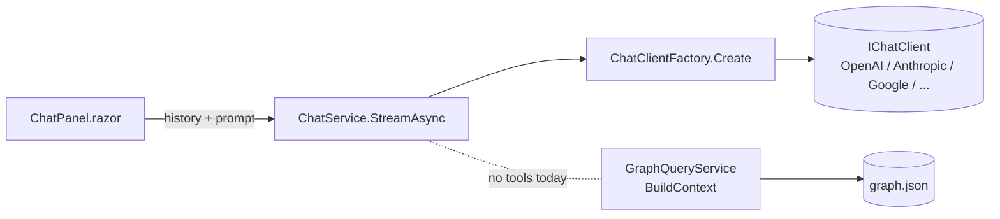
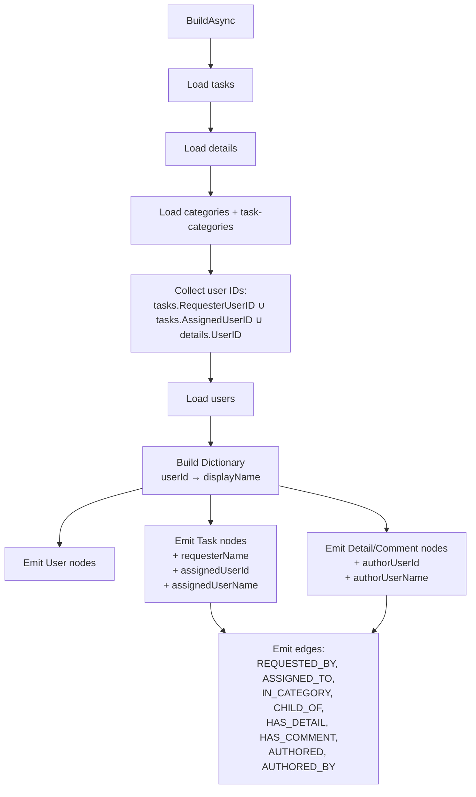
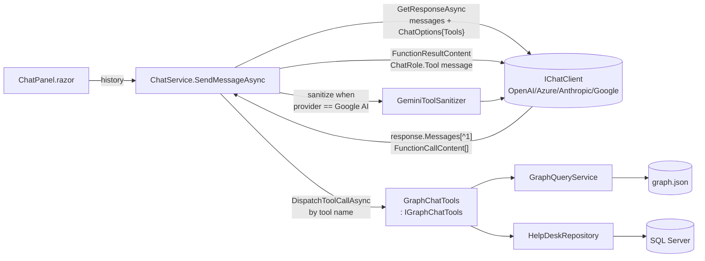
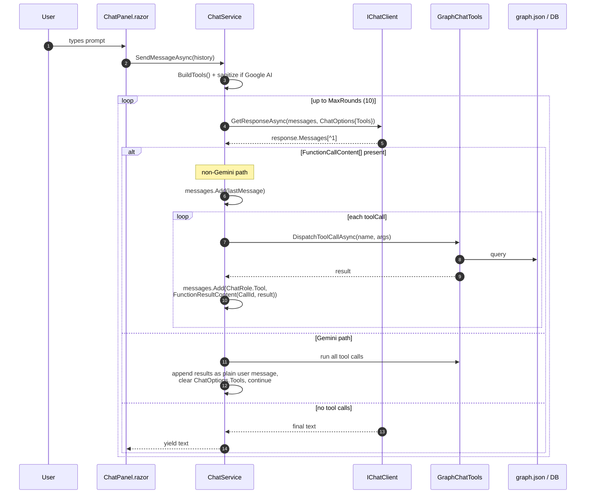
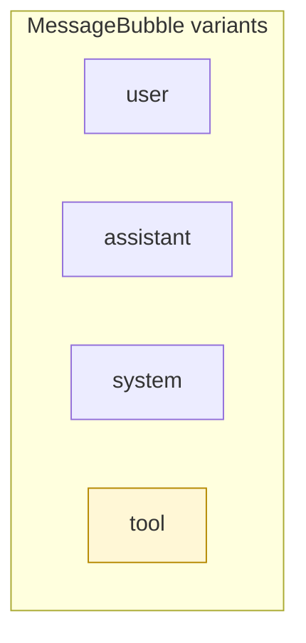

# Graph Page – User Name Tracking & Chat Graph-Traversal Tools

## 1. Overview

This document captures the implementation plan for two related enhancements to the **Graph** and **Chat** pages of `AdefHelpDeskGraphExplorer`:

| # | Feature | Summary |
|---|---------|---------|
| 1 | **Full user name tracking on Tasks and Task Details** | Today the graph only links the *assigned* user (`RequesterUserID`) on a `Task` and the author on a `TaskDetail`. We need to surface a human‑readable **name** on every `Task` *and* every `TaskDetail`/`Comment` node, and add explicit edges that show the originating user when one can be resolved. |
| 2 | **AI graph‑traversal tools on the Chat page** | The chat experience must expose **tool / function‑calling endpoints** to the AI so the model can *walk* the graph (look up a task, list comments on a task, find tasks assigned to a user, follow categories, etc.) instead of being limited to the prebuilt keyword excerpt produced by `GraphQueryService.BuildContext`. The approach mirrors the pattern used in **`AIStoryBuilders/Services/StoryChatService.cs`** — a hand‑rolled tool‑call loop over `IChatClient` using `Microsoft.Extensions.AI.AIFunctionFactory`, an `IGraphQueryService` abstraction for read tools, and a Gemini schema sanitiser for cross‑provider compatibility. |

Both features are additive — no schema migrations and no breaking changes to the existing `graph.json` schema.

---

## 2. Current State (Baseline)

### 2.1 Graph build pipeline

The graph is built by [`HelpDeskGraphBuilder`](../Services/Graph/HelpDeskGraphBuilder.cs) from four SQL Server tables and emitted as `App_Data/graph/graph.json`:

- `ADefHelpDesk_Tasks` → `Task` nodes
- `ADefHelpDesk_TaskDetails` → `TaskDetail` / `Comment` nodes
- `ADefHelpDesk_TaskCategories` + `ADefHelpDesk_Categories` → `Category` nodes
- `ADefHelpDesk_Users` → `User` nodes

Edges currently produced:

| Edge type | From | To | Notes |
|-----------|------|----|-------|
| `REQUESTED_BY` | `Task` | `User` | Only when `RequesterUserID` is set. |
| `IN_CATEGORY` | `Task` | `Category` | |
| `CHILD_OF` | `Category` | `Category` | |
| `HAS_DETAIL` / `HAS_COMMENT` | `Task` | `TaskDetail` / `Comment` | |
| `AUTHORED` | `User` | `TaskDetail` / `Comment` | Only when `UserID` is set. |

Task nodes already carry `requesterName` (from `HdTask.RequesterName`) but **`TaskDetail`/`Comment` nodes carry only `userId`** — no resolved name.

### 2.2 Chat pipeline

[`ChatService`](../Services/AI/ChatService.cs) streams tokens from the active `IChatClient` (registered via `ChatClientFactory`). Grounding context is built **once** per turn by [`GraphQueryService.BuildContext`](../Services/Graph/GraphQueryService.cs) using a keyword match against node labels and data values. The AI cannot ask follow‑up questions of the graph.



---

## 3. Feature 1 – Name Tracking for Tasks and Task Details

### 3.1 Goals

1. Every `Task` node exposes a stable, resolved **assigned/requester display name** (fallback chain: `Users.FirstName + LastName` → `Username` → `HdTask.RequesterName` → `"User {id}"`).
2. Every `TaskDetail` / `Comment` node exposes an **author display name** under the same fallback chain.
3. Add an explicit **`AUTHORED_BY`** edge from each `TaskDetail` / `Comment` to its author `User` (the existing `AUTHORED` edge points *from* User → Detail; we keep both directions to make traversal easier in either query style).
4. Add a denormalised `assignedUserId` / `assignedUserName` on every `Task` node (the field name is kept distinct from `requesterUserId` to avoid breaking existing consumers).
5. Surface the new fields in `NodePropertiesPanel.razor`.

### 3.2 Data model changes

No DB schema change. Two small model touches:

**`Models/Graph/GraphNode.cs`** – no code change required; `Data` is `Dictionary<string, object?>` so new keys are additive.

**`Models/HelpDesk/Entities.cs`** – no change unless the legacy `Tasks` table has an `AssignedUserID` column we should also project. If it does (TBD during implementation), add:

```csharp
public int? AssignedUserID { get; set; }
```

If the field does **not** exist in the schema, "assigned" is treated as a synonym of "requester" for now and the new `assignedUserName` simply mirrors `requesterName`.

### 3.3 Builder changes (`HelpDeskGraphBuilder`)



Concrete steps:

1. **After** users are loaded, build:

   ```csharp
   string DisplayName(HdUser u) =>
       !string.IsNullOrWhiteSpace($"{u.FirstName} {u.LastName}".Trim())
           ? $"{u.FirstName} {u.LastName}".Trim()
           : (!string.IsNullOrWhiteSpace(u.Username) ? u.Username! : $"User {u.UserID}");

   var nameById = users.ToDictionary(u => u.UserID, DisplayName);
   ```

2. **Task node Data**: add `assignedUserId` and `assignedUserName` keys; keep `requesterUserId` and `requesterName` as today. When `RequesterUserID` resolves in `nameById`, prefer that over the raw `HdTask.RequesterName`.

3. **Detail/Comment node Data**: add `authorUserId` (mirrors `userId`) and `authorUserName` (resolved through `nameById`, otherwise `null`).

4. **Edges**:
   - Add `ASSIGNED_TO` (Task → User) when an `AssignedUserID` is present and resolvable.
   - Add `AUTHORED_BY` (TaskDetail/Comment → User) in addition to `AUTHORED`.

### 3.4 UI changes

`Components/Graph/NodePropertiesPanel.razor` – render the new fields under a "People" section when present:

| Property | Source key |
|----------|------------|
| Requester | `requesterName` |
| Assigned to | `assignedUserName` |
| Author | `authorUserName` |

The Graph page legend (`Components/Pages/Graph.razor`) gets `ASSIGNED_TO` and `AUTHORED_BY` colour swatches matching the existing edge palette.

### 3.5 Acceptance criteria

- `graph.json` regenerated from the demo dataset contains `authorUserName` on every `TaskDetail` / `Comment` node where a user can be resolved.
- Clicking a comment in the graph shows the author name without any client‑side lookup.
- Existing tests / smoke runs still pass; no consumer of the existing `requesterName` field breaks.

---

## 4. Feature 2 – Graph‑Traversal Tools for the AI

### 4.1 Goals

1. Replace the static "build one excerpt per turn" pattern with an **agentic loop** where the AI can call typed tools to query the graph until it has enough context to answer.
2. Keep the implementation **provider‑agnostic** — works for the same set of `IChatClient` providers already in `ChatClientFactory` (OpenAI, AzureOpenAI, Anthropic, Google AI).
3. Follow the AIStoryBuilders layering (reference: `C:\Users\Administrator\source\repos\AIStoryBuilders\AIStoryBuilders\Services\StoryChatService.cs`):
   - A narrow **read‑only query interface** (`IGraphChatTools`) describing the operations the AI is allowed to perform.
   - A single **service implementation** (`GraphChatTools`) that implements those operations against `GraphQueryService` and `HelpDeskRepository`.
   - A **hand‑rolled tool‑call loop** inside `ChatService` that calls `IChatClient.GetResponseAsync`, inspects `FunctionCallContent`, dispatches by name, and appends `FunctionResultContent` — exactly as `StoryChatService.SendMessageAsync` does.
   - A **provider quirk layer**: `GeminiToolSanitizer` (copied / adapted from AIStoryBuilders) to rewrite tool JSON schemas into the strict subset Google Gemini accepts, plus the AIStoryBuilders fallback that re‑asks Gemini once without tools when the SDK rejects the function‑declaration round‑trip.

### 4.2 Architecture

Unlike `Microsoft.Extensions.AI`'s `FunctionInvokingChatClient`, AIStoryBuilders runs the tool loop **by hand** because:

- Gemini's `Mscc.GenerativeAI` adapter occasionally rejects the second turn of a function‑calling round‑trip (thought‑signature bug), so a controlled re‑prompt path is needed.
- The loop centralises logging, mutation gating (`confirmed=false` preview pattern), and per‑turn hop limits.

We adopt the same approach.



### 4.3 Tool surface (initial set)

All tools are pure read operations. Inputs and outputs are JSON‑serialisable record types. Methods are decorated with `[Description("…")]` so `AIFunctionFactory.Create(...)` generates a usable schema for every supported provider.

| Tool | Signature | Returns | Description |
|------|-----------|---------|-------------|
| `search_nodes` | `(string query, string? type, int max = 20)` | `NodeSummary[]` | Keyword search across labels + data values, optionally filtered by node `Type`. |
| `get_node` | `(string id)` | `NodeDetail?` | Full `Data` payload for a single node. |
| `get_neighbors` | `(string id, string? edgeType, int max = 25)` | `Neighbor[]` | 1‑hop neighbours, optionally filtered by edge type. |
| `list_tasks_for_user` | `(int userId, string? status, int max = 25)` | `TaskSummary[]` | Tasks where the user is requester or assignee. |
| `list_comments_for_task` | `(int taskId, int max = 50)` | `CommentSummary[]` | Ordered (by `insertedUtc`) comments + details for a task, each with `authorUserName`. |
| `list_tasks_in_category` | `(int categoryId, bool includeDescendants = true, int max = 25)` | `TaskSummary[]` | Walks `CHILD_OF` when `includeDescendants` is `true`. |
| `find_user_by_name` | `(string query, int max = 10)` | `UserSummary[]` | Resolves natural‑language names to `User` nodes. |
| `graph_stats` | `()` | `GraphStats` | Counts by node type & edge type; useful for the AI to plan queries. |

### 4.4 Code layout

```
Services/
  AI/
    ChatService.cs                  (modified – adds tool-call loop)
    GeminiToolSanitizer.cs          (new – adapted from AIStoryBuilders)
    GraphTools/
      IGraphChatTools.cs            (new – read-only graph query surface)
      GraphChatTools.cs             (new – implementation)
      GraphToolDtos.cs              (new – record types returned by tools)
      GraphToolRegistration.cs      (new – BuildTools() returning IList<AITool>)
```

### 4.5 Tool implementation pattern

Follow the AIStoryBuilders inline‑lambda style — tools are registered via `AIFunctionFactory.Create(lambda, "ToolName")` with `[Description]` on both the lambda and every parameter. This produces clean schemas without forcing every tool to be a public method on the service interface.

```csharp
// GraphChatTools/GraphToolRegistration.cs
public static class GraphToolRegistration
{
    public static IList<AITool> BuildTools(IGraphChatTools t) =>
    [
        AIFunctionFactory.Create(
            [Description("Search graph nodes by keyword. Optional 'type' filters to Task, User, Category, Comment, or TaskDetail.")]
            ([Description("Free-text query — names, words, IDs.")] string query,
             [Description("Optional node type filter.")] string? type,
             [Description("Maximum number of results (1-100).")] int max)
                => t.SearchNodes(query, type, max),
            "SearchNodes"),

        AIFunctionFactory.Create(
            [Description("Get the full data payload for a single node by id (e.g., 'task:42').")]
            ([Description("The node id")] string id) => t.GetNode(id),
            "GetNode"),

        AIFunctionFactory.Create(
            [Description("Get 1-hop neighbours of a node, optionally filtered by edge type.")]
            ([Description("The node id")] string id,
             [Description("Optional edge type: REQUESTED_BY, ASSIGNED_TO, IN_CATEGORY, CHILD_OF, HAS_DETAIL, HAS_COMMENT, AUTHORED, AUTHORED_BY.")] string? edgeType,
             [Description("Max neighbours (1-100).")] int max)
                => t.GetNeighbors(id, edgeType, max),
            "GetNeighbors"),

        AIFunctionFactory.Create(
            [Description("List tasks where the given user is the requester or assignee.")]
            ([Description("The user id")] int userId,
             [Description("Optional status filter (e.g., Open, Closed).")] string? status,
             [Description("Max tasks (1-100).")] int max)
                => t.ListTasksForUser(userId, status, max),
            "ListTasksForUser"),

        AIFunctionFactory.Create(
            [Description("Get all task details and comments for a task, ordered by insertedUtc. Each result includes authorUserName.")]
            ([Description("The task id")] int taskId,
             [Description("Max results (1-100).")] int max)
                => t.ListCommentsForTask(taskId, max),
            "ListCommentsForTask"),

        AIFunctionFactory.Create(
            [Description("List tasks in a category, optionally walking CHILD_OF to include descendant categories.")]
            ([Description("The category id")] int categoryId,
             [Description("Include descendant categories (default true).")] bool includeDescendants,
             [Description("Max tasks (1-100).")] int max)
                => t.ListTasksInCategory(categoryId, includeDescendants, max),
            "ListTasksInCategory"),

        AIFunctionFactory.Create(
            [Description("Resolve a natural-language person name to one or more User nodes.")]
            ([Description("The name or partial name to look up.")] string query,
             [Description("Max matches (1-25).")] int max)
                => t.FindUserByName(query, max),
            "FindUserByName"),

        AIFunctionFactory.Create(
            [Description("High-level graph statistics: counts by node type and edge type.")]
            () => t.GraphStats(),
            "GraphStats"),
    ];
}
```

`IGraphChatTools` itself stays plain — no attributes are needed on the interface; `AIFunctionFactory` reads the attributes from the lambda parameters above. Tool implementations are thin shims over `GraphQueryService.Snapshot()` and the already‑loaded `GraphDocument`.

### 4.6 ChatService changes — hand‑rolled tool loop

The loop mirrors `StoryChatService.SendMessageAsync` lines 110–245.



Key code in `ChatService.cs`:

1. Resolve `IGraphChatTools` from the DI scope and call `GraphToolRegistration.BuildTools(tools)`.
2. If `providerKey == "GoogleAI"`, run the list through `GeminiToolSanitizer.SanitizeForGemini(...)`.
3. Construct `ChatOptions { ModelId, MaxOutputTokens, Tools = tools }`; only set `Temperature` when `AICapabilities.SupportsCustomTemperature(model)` returns true (already implemented).
4. Loop up to `MaxRounds` (initial: **10**):
   - `var response = await chatClient.GetResponseAsync(messages, options, ct);`
   - `var lastMessage = response.Messages[^1];`
   - `var toolCalls = lastMessage.Contents.OfType<FunctionCallContent>().ToList();`
   - If any tool calls:
     - **Non‑Gemini**: append `lastMessage`, dispatch each tool call, append a `ChatRole.Tool` message with `FunctionResultContent(toolCall.CallId, result)`.
     - **Gemini**: dispatch each tool call, append results as one `ChatRole.User` message containing JSON code‑fenced sections, *clear* `options.Tools = null`, and continue.
   - If no tool calls: yield `response.Text`, break.
5. Wrap the Gemini call in a `try/catch` that, on failure with tools attached, retries once without tools and logs the schema rejection (matches AIStoryBuilders).
6. Streaming UX: AIStoryBuilders yields the entire final text once. For our Chat page we preserve the current streaming UX by switching to `GetStreamingResponseAsync` **only on the final round** (when the previous response had no tool calls). Until then we accumulate non‑streamed responses inside the loop, then re‑prompt that final assistant turn in streaming mode without tools attached.

System prompt addendum (appended to `AIOptions.Defaults.SystemPrompt` when tools are enabled):

> You have read‑only tools that query a help‑desk knowledge graph (Tasks, TaskDetails / Comments, Users, Categories). Prefer `FindUserByName` before guessing user IDs. Prefer `SearchNodes` or `ListTasksForUser` before answering from memory. Cite node IDs (e.g. `task:42`) in your answer. Never invent task descriptions or comment text — call `GetNode` or `ListCommentsForTask` first.

### 4.7 Provider compatibility

Capability gating lives next to the existing temperature gate in `AICapabilities`:

```csharp
public static bool SupportsToolCalling(string providerKey, string model) => providerKey switch
{
    "OpenAI" or "AzureOpenAI" => true,
    "Anthropic"               => true,
    "GoogleAI"                => true,
    _                         => false,
};
```

Provider‑specific behaviours (all copied / adapted from AIStoryBuilders):

| Provider | Behaviour |
|----------|-----------|
| OpenAI / Azure OpenAI | Standard `FunctionCallContent` + `FunctionResultContent` round‑trip. |
| Anthropic | Same round‑trip; works out of the box with `Anthropic.SDK`'s `IChatClient`. |
| Google AI (`Mscc.GenerativeAI`) | Schemas must pass through `GeminiToolSanitizer`. Tool follow‑up turn uses the *plain user message* workaround (clear `Tools`, embed results as JSON). On `INVALID_ARGUMENT`, retry once without tools. |

`GeminiToolSanitizer` is ported verbatim from `AIStoryBuilders/AI/GeminiToolSanitizer.cs` (no functional changes needed). Its job is to rebuild every `AIFunction.JsonSchema` into Gemini's accepted subset — root `type: object`, primitive properties only, no `additionalProperties`, no `oneOf`, no nullable type arrays.

If `SupportsToolCalling` returns `false` for the active provider/model, `ChatService` falls back to today's `GraphQueryService.BuildContext` behaviour — that path remains the safety net.

### 4.8 DI wiring (`Program.cs`)

```csharp
builder.Services.AddScoped<IGraphChatTools, GraphChatTools>();
// ChatService and GraphQueryService already registered.
```

`GraphChatTools` is `Scoped` because it depends on the scoped `HelpDeskRepository`.

### 4.9 UI changes

`ChatPanel.razor`:

- Add a small **"AI can browse the graph"** indicator next to the provider/model row when `SupportsToolCalling` is `true`.
- Render tool invocations inline in the message list as collapsible cards (new `MessageBubble` variant `Role == "tool"`), showing tool name, arguments, and a one‑line summary of the result. This is invaluable for debugging and trust.



### 4.10 Telemetry & safety

- Every tool call is logged via `ILogger<ChatService>` with `tool name`, argument JSON, result row count, and elapsed ms — same pattern as `LogService.WriteToLog` calls in AIStoryBuilders.
- Tools enforce a per‑call `max` ceiling (hard cap 100) to keep tool results bounded.
- All tools are **read‑only**; no mutation tools are introduced in this iteration. (AIStoryBuilders pairs `IGraphQueryService` with `IGraphMutationService` and a `confirmed=false → preview → confirmed=true` flow; that is a clear extension point for a future iteration but out of scope here.)
- The loop limits rounds per user turn (`MaxRounds = 10`, matching AIStoryBuilders). On exceeding the cap, the loop exits and the last non‑tool‑call assistant text is returned (or an apology if none was produced).

### 4.11 Acceptance criteria

- With OpenAI selected, asking *"Which tasks did Alice Johnson open and what was the last comment on each?"* causes at least one `FindUserByName`, one `ListTasksForUser`, and one `ListCommentsForTask` call (visible in logs) before the final answer is streamed.
- With Google AI selected, the same question succeeds: tools pass through `GeminiToolSanitizer`, the follow‑up turn uses the plain‑user‑message workaround, and on schema rejection the retry‑without‑tools path is taken.
- Tool cards appear inline in the chat transcript (new `MessageBubble` variant).
- Disabling tool‑capable providers in `Settings` causes the chat to silently fall back to the legacy `GraphQueryService.BuildContext` path and still produce an answer.
- `GraphStats` returns counts consistent with `App_Data/graph/graph.json`.

---

## 5. Cross‑Cutting Concerns

### 5.1 Configuration

Add a `Tools` subsection to `AIOptions`:

```jsonc
"AI": {
  "Tools": {
    "Enabled": true,
    "MaxCallsPerTurn": 6,
    "MaxResultsHardCap": 100
  }
}
```

Wired through `AIOptions.Tools` (new POCO) and respected in `ChatService` + `GraphChatTools`.

### 5.2 Testing strategy

| Layer | Test | Notes |
|-------|------|-------|
| `HelpDeskGraphBuilder` | Unit test that builds a graph from an in‑memory fixture and asserts `authorUserName` is present on every detail node with a known `UserID`. | xUnit + EF Core InMemory (or hand‑rolled `HelpDeskRepository` fake). |
| `GraphChatTools` | Unit tests per method against a synthetic `GraphDocument`. | No network, no LLM. |
| `ChatService` (integration) | Mock `IChatClient` that emits a scripted tool_call sequence; assert that `GraphChatTools` is invoked with the expected args and the final assistant text is streamed. | Use `Microsoft.Extensions.AI.Testing` style fakes. |
| UI smoke | Manual: click‑through the Graph page after rebuild; chat with each enabled provider. | |

### 5.3 Rollout

1. Land Feature 1 alone (builder + UI). Rebuild `graph.json`. Ship.
2. Land Feature 2 behind `AI:Tools:Enabled = true` (default `true` in dev, `false` in prod `appsettings.json` for the first release).
3. After one stabilisation cycle, flip the production default.

---

## 6. File‑Level Change Inventory

| File | Change |
|------|--------|
| [Services/Graph/HelpDeskGraphBuilder.cs](../Services/Graph/HelpDeskGraphBuilder.cs) | Resolve display names; add `assignedUserId/Name`, `authorUserId/Name`; emit `ASSIGNED_TO` and `AUTHORED_BY` edges. |
| [Models/HelpDesk/Entities.cs](../Models/HelpDesk/Entities.cs) | Optionally add `AssignedUserID` to `HdTask` (gated on schema confirmation). |
| [Components/Graph/NodePropertiesPanel.razor](../Components/Graph/NodePropertiesPanel.razor) | Render new People section. |
| [Components/Pages/Graph.razor](../Components/Pages/Graph.razor) | Legend entries for new edge types. |
| [Models/AIOptions.cs](../Models/AIOptions.cs) | Add `ToolsOptions Tools { get; set; }`. |
| Services/AI/GraphTools/IGraphChatTools.cs | **New** interface. |
| Services/AI/GraphTools/GraphChatTools.cs | **New** implementation. |
| Services/AI/GraphTools/GraphToolDtos.cs | **New** record DTOs. |
| Services/AI/GraphTools/GraphToolRegistration.cs | **New** `BuildTools()` returning `IList<AITool>` via `AIFunctionFactory.Create`. |
| Services/AI/GeminiToolSanitizer.cs | **New** — ported from `AIStoryBuilders/AI/GeminiToolSanitizer.cs`. |
| [Services/AI/AICapabilities.cs](../Services/AI/AICapabilities.cs) | Add `SupportsToolCalling`. |
| [Services/AI/ChatService.cs](../Services/AI/ChatService.cs) | Hand‑rolled tool loop (Gemini branch, non‑Gemini branch); fall‑through for incapable providers; switch to streaming on the final round. |
| [Components/Chat/ChatPanel.razor](../Components/Chat/ChatPanel.razor) | Tools‑on indicator; thread tool messages. |
| [Components/Chat/MessageBubble.razor](../Components/Chat/MessageBubble.razor) | New `tool` variant. |
| [Program.cs](../Program.cs) | Register `IGraphChatTools`. |
| [appsettings.json](../appsettings.json) | Add `AI:Tools` section. |

---

## 7. Open Questions

1. Does `ADefHelpDesk_Tasks` have an `AssignedUserID` column distinct from `RequesterUserID`? If not, "assigned" semantics collapse onto "requester" for Feature 1.
2. Should the AI be allowed to *traverse* the underlying DB for fields that are not denormalised into `graph.json` (e.g., `RequesterEmail`)? Recommendation: **yes**, but gated behind a separate `db_*` tool family in a follow‑up iteration.
3. Should tool messages be persisted in chat history, or pruned before the next LLM round‑trip? Recommendation: **persist locally for the user**, **prune before sending to the model** once the final assistant text is produced, to keep token use predictable.
