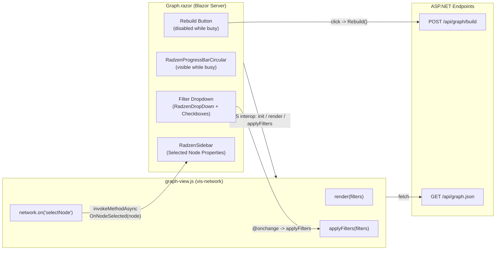
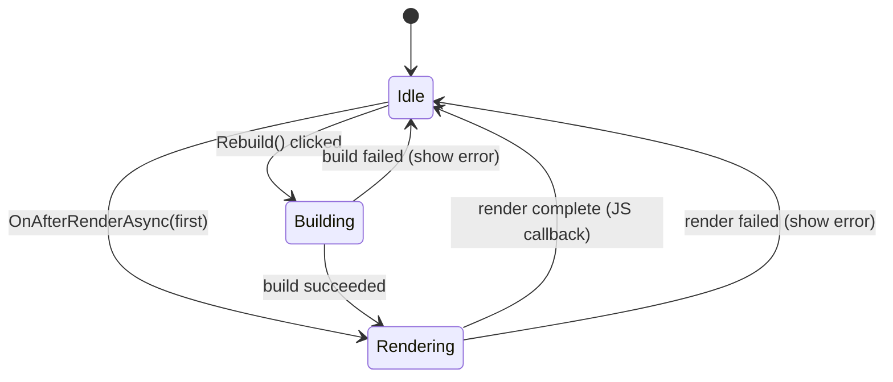
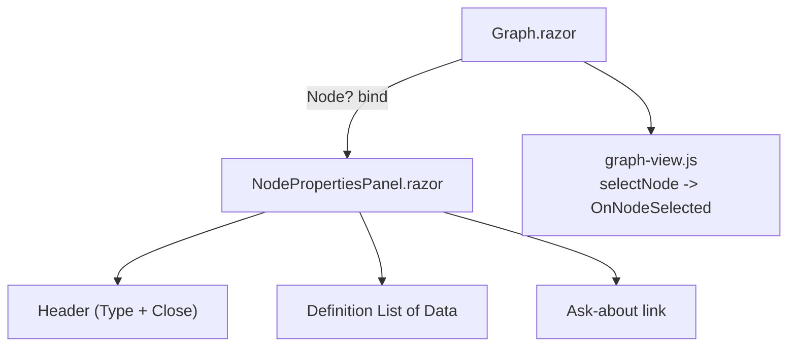
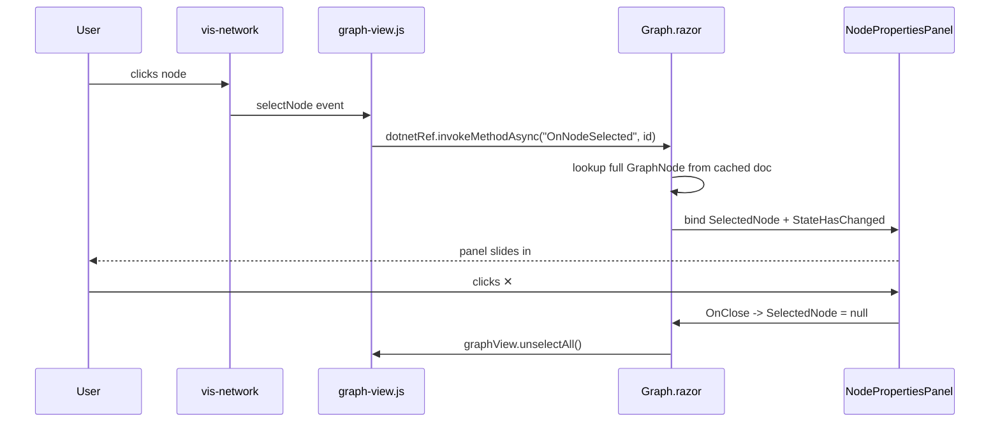
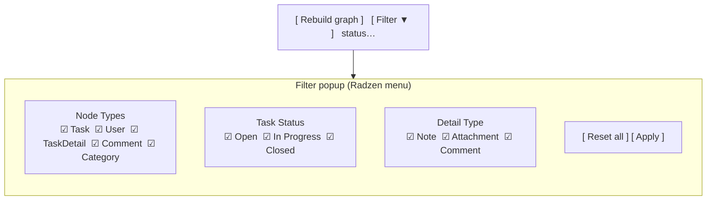
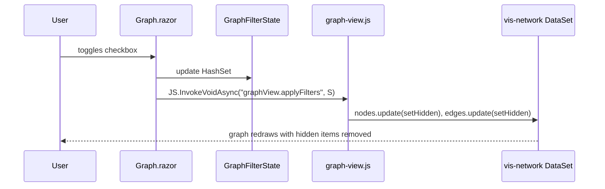

# Graph Page Feature Implementation Plan

## Overview

This document describes the implementation plan for three enhancements to the **Graph** page (`Components/Pages/Graph.razor`) of the `AdefHelpDeskGraphExplorer` Blazor Server application:

1. **Loading indicator + disabled Rebuild button** while the graph is being built or rendered.
2. **Node-properties sidebar** that opens when a node is clicked (modeled after the panel pattern used in `StoryParserProofOfConcept`).
3. **Multi-select filter dropdown** with checkboxes to filter the visible graph by **Task**, **User**, **Task Status**, and **Detail Type** (also modeled after `StoryParserProofOfConcept`).

The app already references **Radzen.Blazor 10.3.2** (see [AdefHelpDeskGraphExplorer.csproj](../AdefHelpDeskGraphExplorer.csproj)), so the UI work re-uses the same component family (`RadzenCard`, `RadzenButton`, `RadzenProgressBarCircular`, `RadzenDropDown`, `RadzenCheckBoxList`, `RadzenSidebar`, etc.) already used in the StoryParser project.

---

## 1. Current State

### Razor markup (excerpt)

[Components/Pages/Graph.razor](../Components/Pages/Graph.razor) currently:

- Renders a single `<div id="graph-container">`.
- Has a plain Bootstrap **Rebuild graph** button with a `_busy` flag toggled only during the POST to `api/graph/build`.
- Shows a small `<div>` below the graph when a node is selected.
- Has no filtering UI.

### JavaScript layer

[wwwroot/js/graph-view.js](../wwwroot/js/graph-view.js) exposes `window.graphView.init(containerId, dotnetRef)` and `window.graphView.render()`. `render()` fetches `/api/graph.json`, builds vis-network `DataSet`s, instantiates a network, and wires `selectNode` to `OnNodeSelected`.

### Node model

[Models/Graph/GraphNode.cs](../Models/Graph/GraphNode.cs) exposes:

```csharp
public string Id { get; set; }
public string Type { get; set; }     // "User" | "Category" | "Task" | "TaskDetail" | "Comment"
public string Label { get; set; }
public Dictionary<string, object?> Data { get; set; }
```

Task status is stored on `Task` nodes inside `Data["Status"]` (string), and detail type is stored on `TaskDetail` nodes inside `Data["DetailType"]` — confirm exact keys in [Services/Graph/HelpDeskGraphBuilder.cs](../Services/Graph/HelpDeskGraphBuilder.cs) and align before coding (see [§5.3](#53-data-contract-for-filter-fields)).

---

## 2. Target Architecture



---

## 3. Feature 1 — Loading Indicator + Disabled Rebuild Button

### Goals

- Disable **Rebuild graph** button whenever:
  - The server-side build is running (`POST /api/graph/build`), **or**
  - The vis-network render is in progress (the initial load on page open *and* every re-render).
- Show a clear loading visual centered over the `#graph-container` while either operation is in flight.

### UX

- Button text toggles: `Rebuild graph` ⇄ `Building…` ⇄ `Rendering…`.
- Overlay shows a `RadzenProgressBarCircular` (Indeterminate) with a status string (`"Loading graph…"`, `"Building graph…"`, etc.).
- The graph container is dimmed (`opacity: 0.4; pointer-events: none`) under the overlay.

### State machine



### Implementation steps

1. Add a single `GraphPageState` enum (`Idle`, `Building`, `Rendering`) and field `_state` to [Components/Pages/Graph.razor](../Components/Pages/Graph.razor).
2. Replace the `_busy` flag with a computed `IsBusy => _state != GraphPageState.Idle`.
3. Bind button: `Disabled="@IsBusy"`, button text from `_state`.
4. Wrap `#graph-container` in a relatively positioned `<div>`; add an absolutely positioned overlay rendered only when `IsBusy`:

   ```razor
   <div class="graph-wrap">
       <div id="graph-container"></div>
       @if (IsBusy)
       {
           <div class="graph-overlay">
               <RadzenProgressBarCircular Mode="ProgressBarMode.Indeterminate"
                                          ShowValue="false"
                                          Size="ProgressBarCircularSize.Medium" />
               <RadzenText TextStyle="TextStyle.Subtitle1">@StatusText</RadzenText>
           </div>
       }
   </div>
   ```

5. Add JS callback `OnRenderComplete` (new `[JSInvokable]` method) so `graph-view.js` notifies Blazor when vis-network's `stabilizationIterationsDone` (or the awaited `render()` promise) finishes; transition `_state` back to `Idle`.
6. Add CSS in `Components/Pages/Graph.razor.css` (new file):

   ```css
   .graph-wrap { position: relative; }
   .graph-overlay {
       position: absolute; inset: 0;
       display: flex; flex-direction: column; gap: .75rem;
       align-items: center; justify-content: center;
       background: rgba(255,255,255,.6); z-index: 10;
   }
   #graph-container { height: 80vh; border: 1px solid #ccc; }
   ```

### Acceptance criteria

- Opening `/graph` shows the overlay immediately, with the button disabled, until the first render completes.
- Clicking **Rebuild graph** disables the button, shows `Building…`, then `Rendering…`, then re-enables.
- A failed build/render surfaces an error in `_status` and returns to **Idle** with the button enabled.

---

## 4. Feature 2 — Node Properties Sidebar

### Goals

When a node is clicked in vis-network, slide a sidebar in from the right showing:

- Node `Id`, `Type`, `Label`.
- A definition list of every key/value pair in `node.Data`.
- A close (✕) button.
- The existing **"Ask about this node →"** link to `/chat?scope=node:{id}`.

### Reference pattern from StoryParser

The `StoryParserProofOfConcept` project uses a Radzen modal-style edit panel (see `Characters.razor`) and shared sub-components in `Components/Shared/` (`CharacterCard.razor`, `CritiquePanel.razor`). We mirror that pattern by introducing a small reusable component `Components/Graph/NodePropertiesPanel.razor` that takes a `GraphNode?` parameter.

### Component tree



### Click → display flow



### Implementation steps

1. **Cache the full graph document** in Blazor so the panel can render rich properties without another fetch:
   - Add a private `GraphDocument? _graph` field in `Graph.razor`.
   - After a successful render, call a new JS function `graphView.getDocument()` that returns the parsed `g` object, *or* (preferred) fetch `/api/graph.json` once in C# via `HttpFactory` and keep it in memory.
2. **Change** `OnNodeSelected(string id)` to look up the matching node and store it in `_selectedNode` (of type `GraphNode?`).
3. **Create** `Components/Graph/NodePropertiesPanel.razor`:

   ```razor
   @if (Node is not null)
   {
       <RadzenSidebar @bind-Expanded="_open" Style="position: absolute; right: 0; top: 0; bottom: 0; width: 360px; z-index: 20;">
           <RadzenStack Gap="0.75rem" Style="padding: 1rem;">
               <RadzenStack Orientation="Orientation.Horizontal" JustifyContent="JustifyContent.SpaceBetween">
                   <RadzenBadge Text="@Node.Type" BadgeStyle="BadgeStyle.Info" />
                   <RadzenButton Icon="close" Variant="Variant.Text" Click="OnCloseClicked" />
               </RadzenStack>
               <RadzenText TextStyle="TextStyle.H6">@Node.Label</RadzenText>
               <RadzenText TextStyle="TextStyle.Caption">@Node.Id</RadzenText>
               <hr />
               @foreach (var kv in Node.Data)
               {
                   <RadzenStack Gap="0.1rem">
                       <RadzenText TextStyle="TextStyle.Caption" Style="color:#64748b;">@kv.Key</RadzenText>
                       <RadzenText TextStyle="TextStyle.Body2">@(kv.Value?.ToString() ?? "—")</RadzenText>
                   </RadzenStack>
               }
               <RadzenButton Text="Ask about this node →"
                             ButtonStyle="ButtonStyle.Primary"
                             Click="OnAskClicked" />
           </RadzenStack>
       </RadzenSidebar>
   }
   @code {
       [Parameter] public GraphNode? Node { get; set; }
       [Parameter] public EventCallback OnClose { get; set; }
       [Parameter] public EventCallback<GraphNode> OnAsk { get; set; }
       private bool _open = true;
       private Task OnCloseClicked() => OnClose.InvokeAsync();
       private Task OnAskClicked() => OnAsk.InvokeAsync(Node);
   }
   ```

4. In `Graph.razor`, render `<NodePropertiesPanel Node="_selectedNode" OnClose="ClosePanel" OnAsk="NavigateToChat" />` inside `.graph-wrap`.
5. On close, also call JS `graphView.unselectAll()` to remove the selection ring.
6. Style with the existing pattern (`Components/Layout/MainLayout.razor.css`) — the panel must overlay the graph, not push it.

### Acceptance criteria

- Clicking a node opens the panel within ~100 ms.
- Panel shows **all** keys in `Data` for the selected node, plus `Id`, `Type`, `Label`.
- Closing the panel deselects in vis-network.
- Clicking another node updates the panel without flicker.

---

## 5. Feature 3 — Filter Dropdown (Task, User, Task Status, Detail Type)

### Goals

A single dropdown button labeled **Filter** in the toolbar. Opening it reveals four collapsible groups of checkboxes:

| Group | Items |
|-------|-------|
| **Node Types** | Task, User, TaskDetail, Comment, Category |
| **Task Status** | (dynamic — distinct values of `Task.Data["Status"]`) |
| **Detail Type** | (dynamic — distinct values of `TaskDetail.Data["DetailType"]`) |

Checking/unchecking immediately filters the visible graph. The filter state is held in Blazor and pushed to JS via `graphView.applyFilters(...)`.

### Filter state model

```csharp
public sealed class GraphFilterState
{
    public HashSet<string> NodeTypes { get; set; } = new();     // e.g. {"Task","User"}
    public HashSet<string> TaskStatuses { get; set; } = new();  // e.g. {"Open","Closed"}
    public HashSet<string> DetailTypes { get; set; } = new();   // e.g. {"Note","Attachment"}
}
```

A node is **visible** iff:

- `NodeTypes` contains its `Type`, **and**
- If it's a `Task`, `TaskStatuses` contains its `Status` (or `TaskStatuses` is empty = "all"), **and**
- If it's a `TaskDetail`, `DetailTypes` contains its `DetailType` (or empty = "all").

Edges are visible iff both endpoints are visible.

### Reference pattern from StoryParser

`StoryParserProofOfConcept` uses `RadzenDropDown` with `Multiple="true"` for multi-select role/arc pickers (see `Characters.razor` lines 87–96). For the checkbox-list look-and-feel inside a popup, we combine `RadzenDropDown Multiple="true" AllowFiltering="false" Chips="true"` **or** use a `RadzenSplitButton` whose popup hosts `RadzenCheckBoxList`. Recommendation: **`RadzenSplitButton` + grouped `RadzenCheckBoxList`s** because it produces the cleanest grouped UX.

### UX layout



### Data flow



### 5.3 Data contract for filter fields

Before coding the dropdown, confirm/normalize the keys produced by `HelpDeskGraphBuilder`:

| Node `Type` | Required `Data` keys | Notes |
|-------------|----------------------|-------|
| `Task` | `Status` (string) | Source: `Task.Status` enum/string in [Models/HelpDesk/Entities.cs](../Models/HelpDesk/Entities.cs). |
| `TaskDetail` | `DetailType` (string) | Today the builder branches on `isComment`; promote the actual `DetailType` value from the entity into `Data`. |
| `User` | none required | — |

> **Builder change:** Update [Services/Graph/HelpDeskGraphBuilder.cs](../Services/Graph/HelpDeskGraphBuilder.cs) so every `Task` node sets `Data["Status"]` and every `TaskDetail` node sets `Data["DetailType"]`. Add unit coverage if `HelpDeskGraphBuilderTests` exist.

### 5.4 Design decisions

- **All four sections always shown.** Even though the request lists *Task, User, Task Status, Detail Type*, the first two are node-type filters and the last two are attribute filters. Combine them under one dropdown but separated by a heading.
- **Empty set semantics:** an empty `HashSet` in `TaskStatuses` / `DetailTypes` means **show all** (so the user does not have to tick everything on first load).
- **Default state:** all node-type boxes checked; status/detail-type sets empty (= show all).
- **Filtering happens client-side**: the full graph is fetched once and vis-network nodes/edges are hidden via `.update({ id, hidden: true })`. No re-fetch.

### 5.5 Implementation steps

1. **Models:** add `Models/Graph/GraphFilterState.cs` per [§5](#5-feature-3--filter-dropdown-task-user-task-status-detail-type).
2. **Service helper:** add a small Blazor-side helper `GraphFilterFacets(GraphDocument doc)` that returns:

   ```csharp
   public record GraphFacets(
       IReadOnlyList<string> NodeTypes,
       IReadOnlyList<string> TaskStatuses,
       IReadOnlyList<string> DetailTypes);
   ```

   Computed by `LINQ Distinct()` over `_graph.Nodes`.
3. **Razor markup** — add inside the toolbar of `Graph.razor`:

   ```razor
   <RadzenSplitButton Text="Filter" Icon="filter_alt" Click="@(args => {})">
       <ChildContent>
           <RadzenStack Gap="1rem" Style="padding: 1rem; min-width: 260px;">
               <RadzenText TextStyle="TextStyle.Subtitle2">Node Types</RadzenText>
               <RadzenCheckBoxList @bind-Value="_filter.NodeTypesList"
                                   Data="@_facets.NodeTypes"
                                   Orientation="Orientation.Vertical"
                                   Change="ApplyFilters" />

               <RadzenText TextStyle="TextStyle.Subtitle2">Task Status</RadzenText>
               <RadzenCheckBoxList @bind-Value="_filter.TaskStatusesList"
                                   Data="@_facets.TaskStatuses"
                                   Orientation="Orientation.Vertical"
                                   Change="ApplyFilters" />

               <RadzenText TextStyle="TextStyle.Subtitle2">Detail Type</RadzenText>
               <RadzenCheckBoxList @bind-Value="_filter.DetailTypesList"
                                   Data="@_facets.DetailTypes"
                                   Orientation="Orientation.Vertical"
                                   Change="ApplyFilters" />

               <RadzenButton Text="Reset" ButtonStyle="ButtonStyle.Light"
                             Click="ResetFilters" />
           </RadzenStack>
       </ChildContent>
   </RadzenSplitButton>
   ```

   > Because `RadzenCheckBoxList` binds to `IEnumerable<T>`, expose `…List` wrapper properties on `GraphFilterState` that convert to/from the underlying `HashSet`.
4. **C# wiring:**

   ```csharp
   private GraphFilterState _filter = new();
   private GraphFacets _facets = new(Array.Empty<string>(), Array.Empty<string>(), Array.Empty<string>());

   private async Task ApplyFilters()
   {
       await JS.InvokeVoidAsync("graphView.applyFilters", _filter);
   }

   private async Task ResetFilters()
   {
       _filter = new GraphFilterState { NodeTypesList = _facets.NodeTypes.ToList() };
       await ApplyFilters();
   }
   ```

   Populate `_facets` after the graph document is loaded; pre-fill `_filter.NodeTypesList` with all known types.
5. **JS layer** — extend [wwwroot/js/graph-view.js](../wwwroot/js/graph-view.js):

   ```js
   let lastDoc = null;

   async function render() {
       const res = await fetch('/api/graph.json');
       if (!res.ok) { /* …existing fallback… */ return; }
       lastDoc = await res.json();
       buildNetwork(lastDoc, defaultFilter());
   }

   function applyFilters(filter) {
       if (!lastDoc || !network) return;
       const visible = computeVisibility(lastDoc, filter);
       network.body.data.nodes.update(
           lastDoc.nodes.map(n => ({ id: n.id, hidden: !visible.nodes.has(n.id) }))
       );
       network.body.data.edges.update(
           lastDoc.edges.map(e => ({
               id: e.id,
               hidden: !(visible.nodes.has(e.source) && visible.nodes.has(e.target))
           }))
       );
   }

   function computeVisibility(doc, f) {
       const types     = new Set(f.NodeTypes ?? []);
       const statuses  = new Set(f.TaskStatuses ?? []);
       const details   = new Set(f.DetailTypes ?? []);
       const allStatus = statuses.size === 0;
       const allDetail = details.size === 0;
       const keep = new Set();
       for (const n of doc.nodes) {
           if (types.size > 0 && !types.has(n.type)) continue;
           if (n.type === 'Task'       && !allStatus && !statuses.has(n.data?.Status))     continue;
           if (n.type === 'TaskDetail' && !allDetail && !details.has(n.data?.DetailType))  continue;
           keep.add(n.id);
       }
       return { nodes: keep };
   }

   return { init, render, applyFilters, unselectAll: () => network?.unselectAll(),
            getDocument: () => lastDoc };
   ```

6. **Property-name casing:** `JS.InvokeVoidAsync` serializes with `JsonNamingPolicy.CamelCase` by default in ASP.NET — confirm the Blazor app's default (`Program.cs`). If not camel-case, either set `[JsonPropertyName]` attributes on `GraphFilterState` or read `f.nodeTypes`/`f.NodeTypes` defensively in JS.

### 5.6 Acceptance criteria

- Opening the dropdown shows three labeled sections with checkboxes derived from the **actually present** values in the loaded graph.
- Toggling any checkbox updates the visible graph **without** re-fetching `/api/graph.json`.
- Edges to hidden nodes disappear.
- **Reset** restores all-types-checked + empty status/detail sets (= show everything).
- The Rebuild flow re-derives facets and preserves the existing user filter where the option still exists; new options become checked by default for the node-type set, empty for the others.

---

## 6. File-by-File Change Summary

| File | Change |
|------|--------|
| [Components/Pages/Graph.razor](../Components/Pages/Graph.razor) | Replace `_busy` with state machine; add overlay; add toolbar with `RadzenSplitButton`; render `NodePropertiesPanel`; new methods `ApplyFilters`, `ResetFilters`, `ClosePanel`, `OnRenderComplete`. |
| `Components/Pages/Graph.razor.css` *(new)* | Styles for `.graph-wrap`, `.graph-overlay`. |
| `Components/Graph/NodePropertiesPanel.razor` *(new)* | Reusable Radzen sidebar component. |
| `Models/Graph/GraphFilterState.cs` *(new)* | Filter DTO with `HashSet` + `IList` adapters. |
| `Models/Graph/GraphFacets.cs` *(new)* | Record of distinct values for the three facets. |
| [Services/Graph/HelpDeskGraphBuilder.cs](../Services/Graph/HelpDeskGraphBuilder.cs) | Ensure `Task` nodes set `Data["Status"]` and `TaskDetail` nodes set `Data["DetailType"]`. |
| [wwwroot/js/graph-view.js](../wwwroot/js/graph-view.js) | Cache `lastDoc`; add `applyFilters`, `unselectAll`, `getDocument`; invoke a new `OnRenderComplete` Blazor callback after `stabilizationIterationsDone`. |
| [Components/_Imports.razor](../Components/_Imports.razor) | Add `@using Radzen` / `@using Radzen.Blazor` and `@using AdefHelpDeskGraphExplorer.Models.Graph` if not already present. |
| [Program.cs](../Program.cs) | Confirm `services.AddRadzenComponents()` is registered (required by Radzen 10). |

---

## 7. Testing Plan

### Manual

1. **Cold load**: navigate to `/graph`. Overlay shown immediately; Rebuild disabled; overlay disappears once the network stabilizes.
2. **Rebuild**: click **Rebuild graph**; button shows `Building…` then `Rendering…`; overlay visible the entire time.
3. **Node click**: click each of the 5 node types. The sidebar shows correct `Type` badge, `Label`, all `Data` keys.
4. **Close panel**: ✕ removes the panel and clears the vis-network selection ring.
5. **Filter — node types**: untick `Comment`; all comment nodes and their `HAS_COMMENT` edges disappear.
6. **Filter — Task Status**: tick only `Open`; only Tasks with `Status=="Open"` remain visible; their `TaskDetail`/`Comment` children remain (because their type is still allowed), but edges to hidden Tasks are hidden.
7. **Reset**: full graph reappears.
8. **Build → filter persistence**: configure a non-default filter, click **Rebuild**, confirm the filter is re-applied to the new graph.

### Automated (optional)

- `Services/Graph` xUnit tests asserting that `HelpDeskGraphBuilder` emits `Data["Status"]` / `Data["DetailType"]`.
- Playwright/bUnit smoke test for: button disabled during build, sidebar opens on simulated node click, checkbox filter hides expected DOM elements.

---

## 8. Risks & Mitigations

| Risk | Mitigation |
|------|------------|
| Large graphs cause vis-network to stall during physics stabilization. | Already using `physics: { stabilization: true }`; keep the overlay shown until `stabilizationIterationsDone`. |
| Filter UI explodes if `Status` / `DetailType` values are free-text and contain dozens of variants. | Compute facets defensively; show "(empty)" group for null/empty values; sort alphabetically. |
| JSON property casing mismatch between C# and JS. | Use `[JsonPropertyName]` on `GraphFilterState` and read both casings in JS. |
| Radzen 10 not registered in DI. | Verify `builder.Services.AddRadzenComponents();` in `Program.cs`. |

---

## 9. Out of Scope

- Server-side filter pushdown (currently all filtering is client-side).
- Persisting filter state per user across sessions.
- Replacing vis-network with another graph engine.
- Search-by-text within the filter popup (can be added later via `RadzenDropDown AllowFiltering="true"`).
