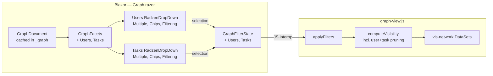
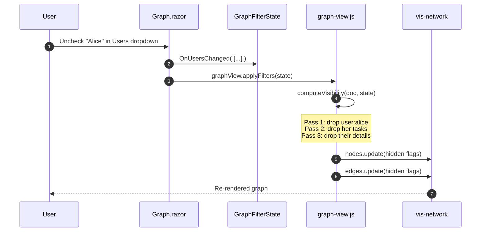
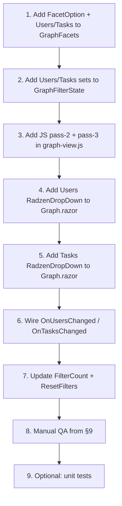

# Graph Page: Per-User and Per-Task Filter Dropdowns

## Overview

This document describes the implementation plan for two new filter controls on the **Graph** page (`Components/Pages/Graph.razor`) of the `AdefHelpDeskGraphExplorer` Blazor Server application:

1. **Users filter** — a dropdown with a checkbox per `User` node, allowing the user to choose which individual users (and their related Tasks / TaskDetails / Comments) should remain visible in the graph.
2. **Tasks filter** — a dropdown with a checkbox per `Task` node, allowing the user to choose which individual tasks (and their related TaskDetails / Comments) should remain visible in the graph.

The styling and interaction pattern mirrors the existing **multi-select with checkboxes** approach used in the sibling repository `C:\Users\Administrator\source\repos\ADefWebserver\StoryParserProofOfConcept` (Radzen Blazor controls, with `RadzenDropDown` configured for `Multiple="true"` / `AllowClear="true"` / `Chips="true"`, or a `RadzenCheckBoxList` inside a popover — both are used interchangeably in that project).

The Graph page already implements category-level filtering via `RadzenCheckBoxList` over **Node Types**, **Task Statuses**, and **Detail Types** (see [Components/Pages/Graph.razor](../Components/Pages/Graph.razor) and [Models/Graph/GraphFilterState.cs](../Models/Graph/GraphFilterState.cs)). The new controls extend that pattern down to **specific entity instances**.

---

## 1. Goals and Non‑Goals

### Goals

- Let the operator pick **exactly which users** are visible. Unchecking a user hides:
  - that User node,
  - every Task whose `requesterUserId` equals that user, and
  - every TaskDetail / Comment attached to those tasks.
- Let the operator pick **exactly which tasks** are visible. Unchecking a task hides:
  - that Task node, and
  - every TaskDetail / Comment whose parent is that task.
- Both dropdowns must support **search/filtering** of their own option list (graphs may contain hundreds of users / tasks).
- Both dropdowns must support **Select All / Clear All** convenience actions.
- The filter result must be applied **client‑side** to the already-rendered vis‑network graph (no rebuild, no server roundtrip), matching the behavior of the current `graphView.applyFilters` JS function.

### Non‑Goals

- No persistence of selections across reloads (Phase 2).
- No server-side filtering of `graph.json` (Phase 2).
- No new node types or edges.
- No change to how the graph is *built* (`HelpDeskGraphBuilder.cs` is untouched).

---

## 2. Reference Pattern (`StoryParserProofOfConcept`)

The Radzen-based multi-select pattern used in the StoryParser project boils down to:

```razor
<RadzenDropDown TValue="IEnumerable<string>"
                Data="@AllOptions"
                @bind-Value="@Selected"
                Multiple="true"
                AllowClear="true"
                AllowFiltering="true"
                Chips="true"
                Placeholder="All users"
                Style="width: 320px;" />
```

Key properties:

| Property          | Purpose                                              |
| ----------------- | ---------------------------------------------------- |
| `Multiple`        | Renders each item as a checkbox.                     |
| `AllowFiltering`  | Adds a search box inside the dropdown.               |
| `Chips`           | Shows selected items as removable chips.             |
| `AllowClear`      | Adds an `x` button to clear the whole selection.     |
| `TValue`          | `IEnumerable<TKey>` for the bound collection.        |

This is the visual / interaction pattern we adopt here. Because the existing Graph filter popover already uses `RadzenCheckBoxList`, we use **`RadzenDropDown` with `Multiple="true"`** for the new controls so the popover stays compact even with hundreds of users or tasks.

---

## 3. Current State (Relevant Code Touchpoints)

| File | Role |
| ---- | ---- |
| [Components/Pages/Graph.razor](../Components/Pages/Graph.razor) | Hosts the filter popover, owns `_filter` and `_facets`. |
| [Models/Graph/GraphFilterState.cs](../Models/Graph/GraphFilterState.cs) | Serializable filter passed to JS. |
| [Models/Graph/GraphFacets.cs](../Models/Graph/GraphFacets.cs) | Distinct value sets derived from a loaded `GraphDocument`. |
| [Models/Graph/GraphNode.cs](../Models/Graph/GraphNode.cs) | Node shape (`Id`, `Type`, `Label`, `Data`). |
| [Services/Graph/HelpDeskGraphBuilder.cs](../Services/Graph/HelpDeskGraphBuilder.cs) | Source of `User` and `Task` node payloads — see lines 55–115. |
| [wwwroot/js/graph-view.js](../wwwroot/js/graph-view.js) | Receives `applyFilters(filter)` and hides/shows nodes + edges. |

### Relevant data on each node

- **`User`** node `Data` contains `userId`, `username`, `email`, `isSuperUser`.
- **`Task`** node `Data` contains `taskId`, `status`, `priority`, `createdUtc`, `dueUtc`, **`requesterUserId`**, `requesterName`, `assignedRoleId`, `description`.
- **`TaskDetail`** / **`Comment`** nodes are connected by edges of the form `task:{id} -> detail:{id}` (see edges produced in `HelpDeskGraphBuilder.cs`).

The **`requesterUserId`** field on `Task` is what links a task to its user; the graph also contains an edge from `user:{id}` to `task:{id}` that we re-use for transitive visibility.

---

## 4. Target Architecture



---

## 5. Data Model Changes

### 5.1 `GraphFacets`

Add two new collections, each as an ordered list of `FacetOption` value objects so the dropdowns can display a human label while filtering on a stable id.

```csharp
public sealed record FacetOption(string Id, string Label);

public sealed record GraphFacets(
    IReadOnlyList<string> NodeTypes,
    IReadOnlyList<string> TaskStatuses,
    IReadOnlyList<string> DetailTypes,
    IReadOnlyList<FacetOption> Users,   // NEW — Id = "user:{userId}", Label = node.Label
    IReadOnlyList<FacetOption> Tasks)   // NEW — Id = "task:{taskId}",  Label = node.Label (+ status chip)
{
    public static GraphFacets Empty { get; } = new(
        Array.Empty<string>(), Array.Empty<string>(), Array.Empty<string>(),
        Array.Empty<FacetOption>(), Array.Empty<FacetOption>());
}
```

In `From(GraphDocument doc)`:

```csharp
var users = doc.Nodes
    .Where(n => n.Type == "User")
    .Select(n => new FacetOption(n.Id, n.Label))
    .OrderBy(o => o.Label, StringComparer.OrdinalIgnoreCase)
    .ToList();

var tasks = doc.Nodes
    .Where(n => n.Type == "Task")
    .Select(n => new FacetOption(n.Id, n.Label))
    .OrderBy(o => o.Label, StringComparer.OrdinalIgnoreCase)
    .ToList();
```

### 5.2 `GraphFilterState`

Add two new selection sets. Empty set = **show all** (consistent with `TaskStatuses` / `DetailTypes`).

```csharp
[JsonPropertyName("users")]
public HashSet<string> Users { get; set; } = new(StringComparer.Ordinal);

[JsonPropertyName("tasks")]
public HashSet<string> Tasks { get; set; } = new(StringComparer.Ordinal);

[JsonIgnore]
public IEnumerable<string> UsersList
{
    get => Users;
    set => Users = value is null
        ? new HashSet<string>(StringComparer.Ordinal)
        : new HashSet<string>(value, StringComparer.Ordinal);
}

[JsonIgnore]
public IEnumerable<string> TasksList
{
    get => Tasks;
    set => Tasks = value is null
        ? new HashSet<string>(StringComparer.Ordinal)
        : new HashSet<string>(value, StringComparer.Ordinal);
}
```

> The `Ids` we store are the **fully-qualified node ids** (`user:42`, `task:7`) so the JS filter can do a direct `Set.has(node.id)` lookup with zero string manipulation.

---

## 6. UI Changes — `Graph.razor`

Add two new sections inside the existing filter popover, between **Node Types** and **Task Status**:

```razor
<RadzenText TextStyle="TextStyle.Subtitle2" Style="margin:0;">Users</RadzenText>
@if (_facets.Users.Count == 0)
{
    <RadzenText TextStyle="TextStyle.Caption" Style="color:#64748b;">(no users)</RadzenText>
}
else
{
    <RadzenDropDown TValue="IEnumerable<string>"
                    Data="@_facets.Users"
                    TextProperty="Label"
                    ValueProperty="Id"
                    Value="@_filter.UsersList"
                    Change="@OnUsersChanged"
                    Multiple="true"
                    AllowClear="true"
                    AllowFiltering="true"
                    Chips="true"
                    Placeholder="All users"
                    Style="width: 100%;" />
    <div class="d-flex gap-2">
        <RadzenButton Text="Select all" Size="ButtonSize.ExtraSmall"
                      ButtonStyle="ButtonStyle.Light"
                      Click="@SelectAllUsers" />
        <RadzenButton Text="Clear" Size="ButtonSize.ExtraSmall"
                      ButtonStyle="ButtonStyle.Light"
                      Click="@ClearUsers" />
    </div>
}

<RadzenText TextStyle="TextStyle.Subtitle2" Style="margin:0;">Tasks</RadzenText>
@* …same pattern, bound to _facets.Tasks / _filter.TasksList… *@
```

### Handlers (in `@code`)

```csharp
private Task OnUsersChanged(object? value)
{
    _filter.UsersList = (value as IEnumerable<string>) ?? Array.Empty<string>();
    return ApplyFilters();
}

private Task OnTasksChanged(object? value)
{
    _filter.TasksList = (value as IEnumerable<string>) ?? Array.Empty<string>();
    return ApplyFilters();
}

private Task SelectAllUsers()
{
    _filter.UsersList = _facets.Users.Select(u => u.Id).ToList();
    return ApplyFilters();
}

private Task ClearUsers()
{
    _filter.UsersList = Array.Empty<string>();
    return ApplyFilters();
}
// + SelectAllTasks / ClearTasks
```

### `FilterCount` update

Add the new selections to the badge counter so the user sees which filters are active:

```csharp
private int FilterCount =>
      ((_facets.NodeTypes.Count    > 0 && _filter.NodeTypes.Count    != _facets.NodeTypes.Count)    ? 1 : 0)
    + ((_filter.TaskStatuses.Count > 0 && _filter.TaskStatuses.Count != _facets.TaskStatuses.Count) ? 1 : 0)
    + ((_filter.DetailTypes.Count  > 0 && _filter.DetailTypes.Count  != _facets.DetailTypes.Count)  ? 1 : 0)
    + (_filter.Users.Count > 0 ? 1 : 0)
    + (_filter.Tasks.Count > 0 ? 1 : 0);
```

### `ResetFilters`

```csharp
_filter = new GraphFilterState
{
    NodeTypesList = _facets.NodeTypes.ToList()
    // Users + Tasks intentionally left empty (= show all)
};
```

---

## 7. JavaScript Changes — `graph-view.js`

Extend `computeVisibility(doc, filter)` so it understands the two new sets. The function already walks every node once; we add an early-reject branch for users and tasks, then a **transitive pass** so that hiding a user hides its tasks and their details.

```js
function computeVisibility(doc, filter) {
    const typesArr   = toArray(readPropCaseInsensitive(filter, 'nodeTypes',    'NodeTypes'));
    const statusArr  = toArray(readPropCaseInsensitive(filter, 'taskStatuses', 'TaskStatuses'));
    const detailArr  = toArray(readPropCaseInsensitive(filter, 'detailTypes',  'DetailTypes'));
    const userArr    = toArray(readPropCaseInsensitive(filter, 'users',        'Users'));
    const taskArr    = toArray(readPropCaseInsensitive(filter, 'tasks',        'Tasks'));

    const types    = new Set(typesArr);
    const statuses = new Set(statusArr);
    const details  = new Set(detailArr);
    const users    = new Set(userArr);   // empty = all
    const tasks    = new Set(taskArr);   // empty = all

    const allUsers = users.size === 0;
    const allTasks = tasks.size === 0;

    // Pass 1 — direct rules on each node.
    const keep = new Set();
    for (const n of doc.nodes) {
        if (types.size && !types.has(n.type)) continue;

        if (n.type === 'User' && !allUsers && !users.has(n.id)) continue;
        if (n.type === 'Task' && !allTasks && !tasks.has(n.id)) continue;

        if (n.type === 'Task' && statuses.size) {
            const s = n.data ? (n.data.status ?? n.data.Status) : null;
            if (!statuses.has(s)) continue;
        }
        if (n.type === 'TaskDetail' && details.size) {
            const d = n.data ? (n.data.detailType ?? n.data.DetailType) : null;
            if (!details.has(d)) continue;
        }
        keep.add(n.id);
    }

    // Pass 2 — task whose requester user is hidden → drop task.
    if (!allUsers) {
        for (const n of doc.nodes) {
            if (n.type !== 'Task' || !keep.has(n.id)) continue;
            const requester = n.data && (n.data.requesterUserId ?? n.data.RequesterUserId);
            if (requester !== undefined && requester !== null) {
                const userId = `user:${requester}`;
                if (!users.has(userId)) keep.delete(n.id);
            }
        }
    }

    // Pass 3 — details/comments whose parent task is hidden → drop them.
    // doc.edges of shape { source: "task:7", target: "detail:42" } drive this.
    const taskOfDetail = new Map();
    for (const e of doc.edges) {
        if (e.source && e.target &&
            e.source.startsWith('task:') &&
            (e.target.startsWith('detail:') || e.target.startsWith('comment:'))) {
            taskOfDetail.set(e.target, e.source);
        }
    }
    for (const [detailId, taskId] of taskOfDetail) {
        if (!keep.has(taskId)) keep.delete(detailId);
    }

    return keep;
}
```

`applyFilters` itself does **not change** — it already updates `hidden` on every node and edge based on the `keep` set.

### Process flow



---

## 8. Edge Cases

| Case | Behavior |
| ---- | -------- |
| Graph not yet loaded (`_graph is null`) | Filter button stays disabled (existing behavior). |
| No `User` nodes in graph | Section shows `(no users)` and dropdown is omitted. |
| No `Task` nodes in graph | Section shows `(no tasks)` and dropdown is omitted. |
| User selected, but **no tasks** selected (empty = all) | Hidden user → her tasks hidden (pass 2). Other users' tasks visible. |
| Both `Users` and `Tasks` filters active | A task is visible only if it survives both: explicitly selected **and** its requester is selected. |
| `Task.requesterUserId` is `null` | Pass 2 leaves it alone; it survives if otherwise selected. |
| Detail with no parent edge | Pass 3 leaves it alone (it's only dropped if its parent edge points to a hidden task). |
| User selects 0 items via `AllowClear` | Treated as "all" (matches existing TaskStatuses semantics). |

---

## 9. Testing Plan

### Manual smoke tests

1. **Empty graph** → open filter popover → Users / Tasks sections render `(no users)` / `(no tasks)`.
2. **Default state** → both selections empty → graph shows everything (no visible change vs. today).
3. **Hide one user** → that user, all of her tasks, and all of those tasks' details disappear together.
4. **Hide one task** → that task and its details/comments disappear; its user remains.
5. **Combine with `Task Status = Open`** → only Open tasks belonging to selected users (or all users) remain.
6. **Search inside dropdown** (`AllowFiltering`) by name → narrows the list of checkboxes.
7. **Chips** → clicking the `x` on a chip removes that user/task and immediately re-applies the filter.
8. **Reset filters** → Users + Tasks both clear back to empty (= all).
9. **Filter badge** → count increases by 1 for each non-empty Users/Tasks selection.

### Unit-test candidates (`Models/Graph`)

- `GraphFacets.From(doc)` populates `Users` / `Tasks` sorted alphabetically by label.
- `GraphFilterState.UsersList` round-trips through `HashSet` correctly.
- JSON serialization of `GraphFilterState` includes `users` and `tasks` arrays.

---

## 10. Implementation Steps (Suggested Order)



Each step compiles and runs independently — the JS changes are backwards-compatible because empty / missing `users` and `tasks` properties on the filter object are treated as "all".

---

## 11. Future Enhancements (Out of Scope)

- Persist last selection in `localStorage` so the filter survives F5.
- "Focus mode": double‑click a user chip → keep only that user.
- Server-side projection of `graph.json?userId=…&taskId=…` for very large tenants.
- Group users by `isSuperUser` in the dropdown header.
- Highlight (rather than hide) unselected nodes via opacity.
