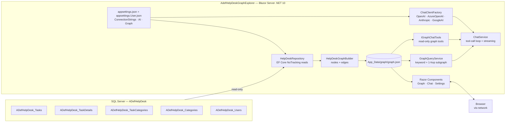
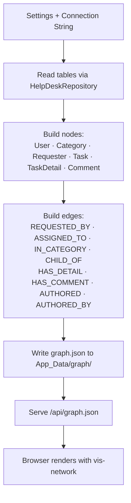
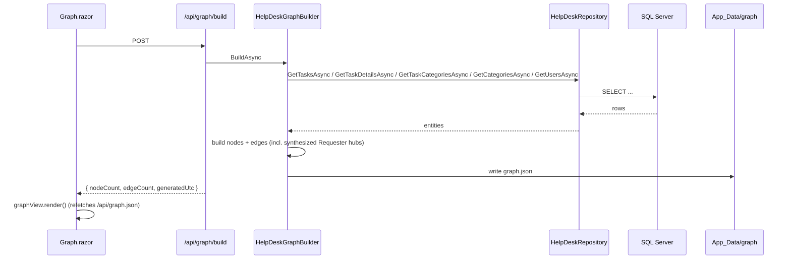
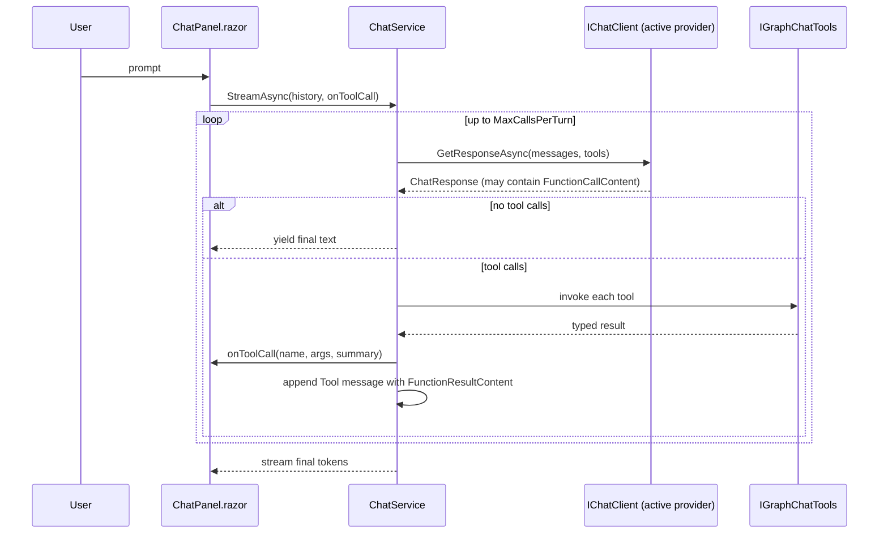

# AdefHelpDeskGraphExplorer — Implementation Plan (as-built)

This document describes the actual architecture of **AdefHelpDeskGraphExplorer** —
a Blazor Server app on **.NET 10** that:

1. Connects to one of four AI providers (**OpenAI**, **Azure OpenAI**, **Anthropic**, **Google AI**) — ported from `SimpleChat`.
2. Reads the existing **ADefHelpDesk** SQL Server database directly (connection string in `appsettings.json`, editable from the Settings page).
3. Parses Tasks / TaskDetails / Comments / Categories / Users into a **`graph.json`** artifact under `App_Data/graph/`.
4. Renders an interactive **vis-network** graph visualizer in the browser with faceted client-side filtering.
5. Offers a **Chat** experience grounded in the help-desk graph. When the active provider supports tool calling the chat exposes a read-only graph-traversal tool surface; otherwise it falls back to a precomputed grounding block injected into the system prompt.

---

## 1. High-Level Architecture



Runtime is a single Blazor Server process. `graph.json` is built on demand from the live database via a minimal API endpoint and cached on disk under the content root.

---

## 2. Feature #1 — AI Provider Configuration (ported from `SimpleChat`)

### 2.1 Options model

`Models/AIOptions.cs`:

```csharp
public sealed class AIOptions
{
    public const string SectionName = "AI";
    public string ActiveProvider { get; set; } = "OpenAI";
    public Dictionary<string, ProviderOptions> Providers { get; set; } = new();
    public ChatDefaults Defaults { get; set; } = new();
    public ToolsOptions Tools { get; set; } = new();
}

public sealed class ToolsOptions
{
    public bool Enabled { get; set; } = true;       // master switch
    public int MaxCallsPerTurn { get; set; } = 6;   // safety cap on tool rounds
    public int MaxResultsHardCap { get; set; } = 100;
}

public sealed class ProviderOptions
{
    public bool Enabled { get; set; }
    public string? ApiKey { get; set; }
    public string? Endpoint { get; set; }
    public string? DefaultModel { get; set; }
    public string? DeploymentName { get; set; } // Azure only
    public string? ApiVersion { get; set; }     // Azure only
    public List<string> Models { get; set; } = new();
}

public sealed class ChatDefaults
{
    public float Temperature { get; set; } = 0.7f;
    public int MaxOutputTokens { get; set; } = 1024;
    public string SystemPrompt { get; set; } = "You are a help-desk analytics assistant.";
}

public sealed class GraphOptions
{
    public const string SectionName = "Graph";
    public string OutputDirectory { get; set; } = "App_Data/graph";
    public bool GenerateEmbeddings { get; set; } = false; // reserved; not currently used
}
```

### 2.2 `appsettings.json`

```jsonc
{
  "ConnectionStrings": {
    "ADefHelpDesk": "Server=localhost;Database=ADefHelpDesk;Trusted_Connection=True;TrustServerCertificate=True"
  },
  "Graph": {
    "OutputDirectory": "App_Data/graph",
    "GenerateEmbeddings": false
  },
  "AI": {
    "ActiveProvider": "OpenAI",
    "Providers": {
      "OpenAI":      { "Enabled": true,  "ApiKey": "", "Endpoint": "https://api.openai.com/v1",                  "DefaultModel": "gpt-4o-mini",             "Models": ["gpt-4o-mini","gpt-4o"] },
      "AzureOpenAI": { "Enabled": false, "ApiKey": "", "Endpoint": "",                                           "DeploymentName": "",                      "ApiVersion": "2024-10-21", "Models": ["gpt-4o","gpt-4o-mini"] },
      "Anthropic":   { "Enabled": false, "ApiKey": "", "Endpoint": "https://api.anthropic.com",                  "DefaultModel": "claude-sonnet-4-20250514", "Models": ["claude-sonnet-4-20250514"] },
      "GoogleAI":    { "Enabled": false, "ApiKey": "", "Endpoint": "https://generativelanguage.googleapis.com",  "DefaultModel": "gemini-2.5-flash",        "Models": ["gemini-2.5-flash","gemini-2.5-pro"] }
    },
    "Defaults": { "Temperature": 0.7, "MaxOutputTokens": 1024, "SystemPrompt": "You are a help-desk analytics assistant." },
    "Tools":    { "Enabled": true, "MaxCallsPerTurn": 6, "MaxResultsHardCap": 100 }
  }
}
```

A writable overlay `appsettings.User.json` (git-ignored) is loaded with
`optional: true, reloadOnChange: true` so the Settings page can persist edits
(API keys, model selection, connection string) without touching `appsettings.json`.

### 2.3 Services

| File | Notes |
|---|---|
| [Services/AI/AIConfigurationService.cs](../Services/AI/AIConfigurationService.cs) | Read/write provider settings; persists to `appsettings.User.json`. Also persists the connection string. |
| [Services/AI/ChatClientFactory.cs](../Services/AI/ChatClientFactory.cs) | Switch on `ActiveProvider` → returns `(IChatClient, modelId)`. |
| [Services/AI/ChatService.cs](../Services/AI/ChatService.cs) | `IAsyncEnumerable<string> StreamAsync(...)` — orchestrates tool-call loop or fallback grounding then streams the final answer. |
| [Services/AI/AnthropicChatClient.cs](../Services/AI/AnthropicChatClient.cs) | REST adapter implementing `IChatClient`. |
| [Services/AI/GoogleAIChatClient.cs](../Services/AI/GoogleAIChatClient.cs) | REST adapter implementing `IChatClient`. |
| [Services/AI/AIModelService.cs](../Services/AI/AIModelService.cs) | Lists available models per provider for the Settings page. |
| [Services/AI/AICapabilities.cs](../Services/AI/AICapabilities.cs) | Gates temperature for reasoning/Anthropic models; flags providers/models that support tool calling. |

Anthropic and Google AI are NOT consumed via vendor SDKs — they are first-class
`IChatClient` REST adapters built on `Microsoft.Extensions.AI`, so no
`Anthropic.SDK` / `Google.GenerativeAI` package is required.

NuGet packages actually referenced (see [AdefHelpDeskGraphExplorer.csproj](../AdefHelpDeskGraphExplorer.csproj)):

| Purpose | Package | Version |
|---|---|---|
| EF Core | `Microsoft.EntityFrameworkCore` | 9.0.0 |
| EF Core SQL Server | `Microsoft.EntityFrameworkCore.SqlServer` | 9.0.0 |
| UI components | `Radzen.Blazor` | 10.3.2 |
| Chat abstraction | `Microsoft.Extensions.AI` | 10.5.0 |
| OpenAI chat client glue | `Microsoft.Extensions.AI.OpenAI` | 10.5.1 |
| OpenAI SDK | `OpenAI` | 2.10.0 |
| Azure OpenAI SDK | `Azure.AI.OpenAI` | 2.5.0-beta.1 |
| Markdown rendering | `Markdig` | 0.42.0 |

vis-network is loaded via CDN script in [Components/App.razor](../Components/App.razor).

### 2.4 Registration in `Program.cs`

```csharp
builder.Configuration.AddJsonFile("appsettings.User.json", optional: true, reloadOnChange: true);

builder.Services.AddRazorComponents().AddInteractiveServerComponents();
builder.Services.AddRadzenComponents();

builder.Services.AddOptions<AIOptions>().Bind(builder.Configuration.GetSection(AIOptions.SectionName));
builder.Services.AddOptions<GraphOptions>().Bind(builder.Configuration.GetSection(GraphOptions.SectionName));

builder.Services.AddHttpClient();
builder.Services.AddSingleton<AIConfigurationService>();
builder.Services.AddSingleton<ChatClientFactory>();
builder.Services.AddHttpClient<AIModelService>();
builder.Services.AddScoped<ChatService>();

builder.Services.AddDbContext<HelpDeskDbContext>((sp, o) =>
{
    var cs = sp.GetRequiredService<IConfiguration>().GetConnectionString("ADefHelpDesk");
    if (!string.IsNullOrWhiteSpace(cs))
        o.UseSqlServer(cs).UseQueryTrackingBehavior(QueryTrackingBehavior.NoTracking);
});
builder.Services.AddScoped<HelpDeskRepository>();
builder.Services.AddSingleton<ConnectionTester>();

builder.Services.AddSingleton<GraphCache>();
builder.Services.AddSingleton<GraphQueryService>();
builder.Services.AddScoped<IHelpDeskGraphBuilder, HelpDeskGraphBuilder>();
builder.Services.AddScoped<IGraphChatTools, GraphChatTools>();
```

### 2.5 Settings UI

[Components/Pages/Settings.razor](../Components/Pages/Settings.razor):

- **Database** card: connection string text box + **Test connection** button → `ConnectionTester.TestAsync(cs)`.
- **AI Settings** card: provider dropdown (OpenAI / Azure OpenAI / Anthropic / Google AI), API key, endpoint/api-version (Azure only), model dropdown with **Refresh models** (live model list via `AIModelService`).
- "Test Access" button → `ChatService.TestAccessAsync(provider)`.
- Save calls `AIConfigurationService.SaveAsync()` which writes the user overlay.

---

## 3. Feature #3 — Configurable Database Connection

### 3.1 `appsettings.json`

`ConnectionStrings:ADefHelpDesk` is the single source of truth. The Settings
page exposes a read/write field for it; saving writes through
`AIConfigurationService` into `appsettings.User.json`.

### 3.2 EF Core read-only context

[Data/HelpDeskDbContext.cs](../Data/HelpDeskDbContext.cs) exposes only the
five tables needed for the graph, all defined in
[Models/HelpDesk/Entities.cs](../Models/HelpDesk/Entities.cs):

| Entity | Table | Notable columns |
|---|---|---|
| `HdTask` | `ADefHelpDesk_Tasks` | `TaskID`, `Description`, `Status`, `Priority`, `CreatedDate`, `DueDate`, `AssignedRoleID`, `RequesterUserID`, `RequesterName`, `RequesterEmail` |
| `HdTaskDetail` | `ADefHelpDesk_TaskDetails` | `DetailID`, `TaskID`, `DetailType`, `InsertDate`, `UserID`, `Description`, `StartTime`, `StopTime` |
| `HdTaskCategory` | `ADefHelpDesk_TaskCategories` | `ID`, `TaskID`, `CategoryID` |
| `HdCategory` | `ADefHelpDesk_Categories` | `CategoryID`, `ParentCategoryID`, `CategoryName`, `Level` |
| `HdUser` | `ADefHelpDesk_Users` | `UserID`, `Username`, `FirstName`, `LastName`, `Email`, `IsSuperUser` |

`DetailType` values observed: `Description`, `Comment`, `TimeEntry`, `Resolution`, `Status`.
Rows with `DetailType = 'Comment'` are projected as `Comment` nodes;
all other detail types become `TaskDetail` nodes carrying `detailType` in `data`.

Note: the entity layer is *not* portal-scoped — `PortalID` was dropped from
the build pipeline. The current implementation reads all rows in the
configured database. (Filtering can be re-added in `HelpDeskRepository` if
needed.)

The context is registered with `UseQueryTrackingBehavior(QueryTrackingBehavior.NoTracking)`
and is built only if a connection string is configured.

[Data/HelpDeskRepository.cs](../Data/HelpDeskRepository.cs) exposes:

- `GetTasksAsync(DateTime? since, CancellationToken ct)`
- `GetTaskDetailsAsync(IEnumerable<int> taskIds, CancellationToken ct)`
- `GetTaskCategoriesAsync(IEnumerable<int> taskIds, CancellationToken ct)`
- `GetCategoriesAsync(CancellationToken ct)`
- `GetUsersAsync(IEnumerable<int> userIds, CancellationToken ct)`

### 3.3 Connection validation

[Services/HelpDesk/ConnectionTester.cs](../Services/HelpDesk/ConnectionTester.cs) — runs a `SELECT TOP 1` probe. Wired to the **Test connection** button in Settings.

---

## 4. Feature #2 + #4 — Graph Build & Visualizer

### 4.1 Pipeline



Working directory: `ContentRoot/App_Data/graph/` (created on first build). The only file currently emitted is `graph.json`. Embeddings are not generated by this build (the `GenerateEmbeddings` option is reserved for a future pass).

### 4.2 `graph.json` schema

```jsonc
{
  "version": 1,
  "generatedUtc": "2026-05-11T12:00:00Z",
  "nodes": [
    { "id": "task:42",        "type": "Task",       "label": "Printer offline",  "data": { "taskId": 42, "status": "Open", "priority": "High", "createdUtc": "...", "dueUtc": "...", "requesterUserId": 7, "requesterName": "Jane Doe", "assignedUserId": 7, "assignedUserName": "Jane Doe", "assignedRoleId": null, "description": "..." } },
    { "id": "detail:910",     "type": "TaskDetail", "label": "Resolution",       "data": { "detailId": 910, "taskId": 42, "detailType": "Resolution", "userId": 3, "authorUserId": 3, "authorUserName": "Bob", "insertedUtc": "...", "text": "...", "startTime": null, "stopTime": null } },
    { "id": "comment:912",    "type": "Comment",    "label": "Comment",          "data": { "detailId": 912, "taskId": 42, "detailType": "Comment", "userId": 7, "authorUserId": 7, "authorUserName": "Jane Doe", "insertedUtc": "...", "text": "...", "startTime": null, "stopTime": null } },
    { "id": "user:7",         "type": "User",       "label": "Jane Doe",         "data": { "userId": 7, "username": "jdoe", "email": "jane@x.com", "isSuperUser": false, "displayName": "Jane Doe" } },
    { "id": "category:5",     "type": "Category",   "label": "Hardware",         "data": { "categoryId": 5, "parentCategoryId": null, "level": 0 } },
    { "id": "requester:acme", "type": "Requester",  "label": "ACME Walk-in",     "data": { "name": "ACME Walk-in", "isRegistered": false, "requestedTaskCount": 3, "sampleTaskIds": ["task:42","task:51","task:77"] } }
  ],
  "edges": [
    { "id": "e1", "source": "task:42",    "target": "user:7",     "type": "REQUESTED_BY" },
    { "id": "e2", "source": "task:42",    "target": "user:7",     "type": "ASSIGNED_TO" },
    { "id": "e3", "source": "task:42",    "target": "category:5", "type": "IN_CATEGORY" },
    { "id": "e4", "source": "task:42",    "target": "detail:910", "type": "HAS_DETAIL" },
    { "id": "e5", "source": "task:42",    "target": "comment:912","type": "HAS_COMMENT" },
    { "id": "e6", "source": "user:3",     "target": "detail:910", "type": "AUTHORED" },
    { "id": "e7", "source": "detail:910", "target": "user:3",     "type": "AUTHORED_BY" },
    { "id": "e8", "source": "category:5", "target": "category:1", "type": "CHILD_OF" }
  ]
}
```

`Requester` is a synthesized node type used as a hub for free-text requesters
(rows on `ADefHelpDesk_Tasks` whose `RequesterName` is populated but whose
`RequesterUserID` does not match any row in `ADefHelpDesk_Users`). One
`requester:<slug>` node is emitted per distinct normalized name and every
matching task gets a `REQUESTED_BY` edge to it. This keeps the visualizer
readable when a single walk-in person submits many tickets.

`AUTHORED_BY` is the reverse of `AUTHORED` and is emitted alongside it so
tool calls and the visualizer can navigate the comment-author relation in
either direction without scanning.

`ASSIGNED_TO` currently mirrors `REQUESTED_BY` because the legacy schema has
no `AssignedUserID` column. When that field is added, populate `assignedUserId`
/ `assignedUserName` from it and emit independent `ASSIGNED_TO` edges.

### 4.3 Node / edge derivation rules

| Source row | Node produced | Edges produced |
|---|---|---|
| `ADefHelpDesk_Users` | `user:{UserID}` | – |
| `ADefHelpDesk_Categories` | `category:{CategoryID}` | If `ParentCategoryID` is set: `category → category` `CHILD_OF` |
| `ADefHelpDesk_Tasks` (any `RequesterUserID` matching a User) | `task:{TaskID}` | `task → user` `REQUESTED_BY` + `task → user` `ASSIGNED_TO` |
| `ADefHelpDesk_Tasks` (free-text `RequesterName`, no matching User) | `task:{TaskID}` + grouped `requester:{slug}` hub | `task → requester` `REQUESTED_BY` |
| `ADefHelpDesk_TaskCategories` | – | `task → category` `IN_CATEGORY` |
| `ADefHelpDesk_TaskDetails` (DetailType ≠ 'Comment') | `detail:{DetailID}` | `task → detail` `HAS_DETAIL`; `user → detail` `AUTHORED`; `detail → user` `AUTHORED_BY` |
| `ADefHelpDesk_TaskDetails` (DetailType = 'Comment') | `comment:{DetailID}` | `task → comment` `HAS_COMMENT`; `user → comment` `AUTHORED`; `comment → user` `AUTHORED_BY` |

Node and edge models live under [Models/Graph/](../Models/Graph/):
`GraphDocument`, `GraphNode`, `GraphEdge`, plus client-side filter helpers
`GraphFacets` and `GraphFilterState`.

### 4.4 Builder service

```csharp
public interface IHelpDeskGraphBuilder
{
    Task<GraphDocument> BuildAsync(IProgress<int>? progress, CancellationToken ct);
    Task SaveAsync(GraphDocument doc, string outputDir, CancellationToken ct);
}
```

Implemented by [Services/Graph/HelpDeskGraphBuilder.cs](../Services/Graph/HelpDeskGraphBuilder.cs). Steps:

1. Read tasks, then detail/category/user dependencies via `HelpDeskRepository` (no portal/since scoping by default).
2. Build a `displayName` map for users and reuse it across requester/author fields on tasks and details.
3. Build node dictionaries keyed by composite ids (`task:`, `user:`, `category:`, `comment:`, `detail:`, `requester:`).
4. Synthesize `Requester` hubs for unregistered requesters and link them.
5. Emit edges, never referencing a missing node.
6. Serialize with `JsonSerializerOptions { WriteIndented = true, PropertyNamingPolicy = CamelCase }`.

### 4.5 API surface

Minimal endpoints in [Program.cs](../Program.cs):

```csharp
app.MapGet("/api/graph.json", (GraphCache cache) =>
    cache.Exists
        ? Results.File(cache.GraphJsonPath, "application/json")
        : Results.NotFound(new { error = "graph.json has not been built yet. POST /api/graph/build." }));

app.MapPost("/api/graph/build", async (
    IHelpDeskGraphBuilder b, GraphCache cache, CancellationToken ct) =>
{
    var doc = await b.BuildAsync(progress: null, ct);
    await b.SaveAsync(doc, cache.OutputDir, ct);
    return Results.Ok(new { nodeCount = doc.Nodes.Count, edgeCount = doc.Edges.Count, generatedUtc = doc.GeneratedUtc });
});
```

[Services/Graph/GraphCache.cs](../Services/Graph/GraphCache.cs) resolves the
output directory (absolute or under the content root) and exposes `GraphJsonPath` + `Exists`.

### 4.6 JavaScript visualizer

Uses **vis-network** loaded from CDN.

[wwwroot/js/graph-view.js](../wwwroot/js/graph-view.js) is exposed as
`window.graphView` and supports:

- `init(containerId, dotnetRef)` and `render()` — fetches `/api/graph.json`, builds vis `DataSet`s with per-`type` group colors, and renders into the container.
- Notifies Blazor when the network finishes rendering (`OnRenderComplete`).
- Server-driven client-side filtering: `applyFilter(filterState)` accepts a `GraphFilterState`-shaped object (`nodeTypes`, `taskStatuses`, `detailTypes`, `users`, `tasks`, `requesters`) and hides nodes that don't match.
- Click-through node selection → `OnNodeSelected` Blazor callback.

### 4.7 Graph page

[Components/Pages/Graph.razor](../Components/Pages/Graph.razor) (mapped to
both `/` and `/graph`):

- **Rebuild graph** button → `POST /api/graph/build`, then re-renders.
- **Filter** popup driven by `GraphFacets` (distinct node types, task statuses, detail types, users, tasks, requesters) — checkbox lists and multi-select dropdowns bind to `GraphFilterState` and call `graphView.applyFilter()`.
- Side panel: [Components/Graph/NodePropertiesPanel.razor](../Components/Graph/NodePropertiesPanel.razor) renders the selected node's `data` payload.

### 4.8 Graph build flow



---

## 5. Feature #2 (continued) — Chat over the Graph

The chat path has two execution modes selected per-turn based on the
active provider's capabilities (`AICapabilities.SupportsToolCalling`).

### 5.1 Tool-enabled path

When the active provider/model supports tool calling, `ChatService` runs a
hand-rolled loop over [IGraphChatTools](../Services/AI/GraphTools/IGraphChatTools.cs)
until the model returns a tool-free final answer, then streams that answer.

[Services/AI/GraphTools/GraphChatTools.cs](../Services/AI/GraphTools/GraphChatTools.cs)
is the read-only implementation against the cached graph document held by
`GraphQueryService.Snapshot()`. Every method is a pure read; the
`MaxResultsHardCap` (default 100) caps any list result.

[Services/AI/GraphTools/GraphToolRegistration.cs](../Services/AI/GraphTools/GraphToolRegistration.cs)
builds the `IList<AITool>` exposed to the model using
`AIFunctionFactory.Create`. The tools:

| Tool | Purpose |
|---|---|
| `SearchNodes(query, type?, max)` | Keyword search over labels + data with per-type enriched summaries. |
| `GetNode(id)` | Full data + edge counts + 1-hop preview (up to 12 neighbors). |
| `GetNeighbors(id, edgeType?, max)` | 1-hop neighbours with status/priority/snippet. |
| `ListTasksForUser(userId, role?, status?, max)` | Tasks the user requested / was assigned / commented on / any. Returns enriched task summaries. |
| `CountTasksForUser(userId, role?)` | Exact count (never capped). |
| `GetUserActivity(userId, maxIdsPerList)` | Full rollup: requested/assigned/commentedOnly/workedOn task lists + counts + authoredCommentCount. |
| `GetTaskParticipants(taskId)` | Everyone on a task with their roles. |
| `ListCommentsForTask(taskId, max)` | All details/comments ordered by `insertedUtc`. |
| `ListTasksInCategory(categoryId, includeDescendants, max)` | Tasks in a category subtree. |
| `GetCategoryRollup(categoryId, includeDescendants)` | Aggregate counts + per-status counts. |
| `FindUserByName(query, max)` | Name lookup over `User` nodes. |
| `ListRequesters(nameContains?, max)` | Distinct requester roster (registered + unregistered) ranked by task count. |
| `Stats()` | Counts by node/edge type. |

`ChatService.StreamAsync` uses non-streaming `GetResponseAsync` for each
tool round (so it can inspect `FunctionCallContent`), invokes the matching
tool with `AIFunctionFactory`-generated argument deserialization, appends a
`Tool`-role message carrying `FunctionResultContent`, and loops up to
`Tools.MaxCallsPerTurn` times. When the model emits no further tool calls,
the loop breaks and the final text is yielded to the UI. A `Func<ToolInvocation, Task>?`
callback on `StreamAsync` lets the chat UI render a card per tool call.

If the first tool-enabled round throws, the service retries once without
tools so a misbehaving provider never produces an empty answer.

### 5.2 Fallback grounding path (no tool support)

For providers/models that do not support tool calling, `ChatService`
precomputes a **GROUNDING DATA** block and merges it into the system
prompt. The block contains, in order:

1. `Stats()` JSON.
2. The full requester roster from `ListRequesters(null, hardCap)` — surfaced unconditionally because requester ranking is a common ask.
3. "Users matched from the prompt" — `GetUserActivity` rollups for any user resolved by name from the last two user turns.
4. "Tasks referenced in the prompt" — `GetTaskParticipants` for any `task:N` referenced in those turns.
5. A small keyword-matched subgraph excerpt from `GraphQueryService.BuildContext`.

`GraphQueryService.BuildContext(scope, prompt, maxNodes=30)`
([Services/Graph/GraphQueryService.cs](../Services/Graph/GraphQueryService.cs))
performs the keyword/scope retrieval: term-tokenized match against labels +
data values, seeded selection, then 1-hop expansion capped at `maxNodes`.
Scope `node:<id>` returns the 1-hop neighborhood of a specific node.

### 5.3 Chat sequence (tool-enabled)



### 5.4 Chat UI

[Components/Pages/Chat.razor](../Components/Pages/Chat.razor) hosts
[Components/Chat/ChatPanel.razor](../Components/Chat/ChatPanel.razor),
[Components/Chat/MessageList.razor](../Components/Chat/MessageList.razor),
[Components/Chat/MessageBubble.razor](../Components/Chat/MessageBubble.razor)
and [Components/Chat/MessageInput.razor](../Components/Chat/MessageInput.razor)
(ported from SimpleChat). Tool invocations surfaced via the `onToolCall`
callback render as cards inline with the assistant's streaming answer.
Markdown is rendered via `Markdig`.

---

## 6. Project Layout (actual)

```
AdefHelpDeskGraphExplorer/
├── Program.cs
├── appsettings.json
├── appsettings.User.json        (gitignored, runtime-written)
├── App_Data/
│   └── graph/
│       └── graph.json           (built artifact)
├── Components/
│   ├── App.razor
│   ├── Routes.razor
│   ├── _Imports.razor
│   ├── Layout/
│   │   ├── MainLayout.razor (+ .css)
│   │   ├── NavMenu.razor (+ .css)
│   │   └── ReconnectModal.razor (+ .css, .js)
│   ├── Pages/
│   │   ├── Graph.razor (+ .css)      mapped to "/" and "/graph"
│   │   ├── Chat.razor
│   │   ├── Settings.razor
│   │   ├── Error.razor
│   │   └── NotFound.razor
│   ├── Chat/
│   │   ├── ChatPanel.razor
│   │   ├── MessageList.razor
│   │   ├── MessageBubble.razor
│   │   └── MessageInput.razor
│   └── Graph/
│       └── NodePropertiesPanel.razor
├── Models/
│   ├── AIOptions.cs                  (AIOptions, ProviderOptions, ChatDefaults, ToolsOptions, GraphOptions)
│   ├── ChatMessage.cs
│   ├── Graph/
│   │   ├── GraphDocument.cs
│   │   ├── GraphNode.cs
│   │   ├── GraphEdge.cs
│   │   ├── GraphFacets.cs
│   │   └── GraphFilterState.cs
│   └── HelpDesk/
│       └── Entities.cs               (HdTask, HdTaskDetail, HdTaskCategory, HdCategory, HdUser)
├── Data/
│   ├── HelpDeskDbContext.cs
│   └── HelpDeskRepository.cs
├── Services/
│   ├── AI/
│   │   ├── AICapabilities.cs
│   │   ├── AIConfigurationService.cs
│   │   ├── AIModelService.cs
│   │   ├── AnthropicChatClient.cs
│   │   ├── ChatClientFactory.cs
│   │   ├── ChatService.cs
│   │   ├── GoogleAIChatClient.cs
│   │   └── GraphTools/
│   │       ├── IGraphChatTools.cs
│   │       ├── GraphChatTools.cs
│   │       ├── GraphToolDtos.cs
│   │       └── GraphToolRegistration.cs
│   ├── Graph/
│   │   ├── IHelpDeskGraphBuilder.cs
│   │   ├── HelpDeskGraphBuilder.cs
│   │   ├── GraphCache.cs
│   │   └── GraphQueryService.cs
│   └── HelpDesk/
│       └── ConnectionTester.cs
├── wwwroot/
│   ├── app.css
│   └── js/
│       ├── graph-view.js
│       └── chat.js
└── docs/
    └── implementation-plan.md   (this file)
```

---

## 7. Configuration Cheat Sheet

`appsettings.json` (final shape):

```jsonc
{
  "ConnectionStrings": {
    "ADefHelpDesk": "Server=localhost;Database=ADefHelpDesk;Trusted_Connection=True;TrustServerCertificate=True"
  },
  "Graph": {
    "OutputDirectory": "App_Data/graph",
    "GenerateEmbeddings": false
  },
  "AI": { /* see §2.2 */ }
}
```

---

## 8. Risks & Mitigations

| Risk | Mitigation |
|---|---|
| `graph.json` too large for big databases | Add date-window filtering in `HelpDeskRepository.GetTasksAsync(since)` and node-type toggles before build. Visualizer already supports client-side filtering by node type/status/user/task/requester. |
| Secrets in `appsettings.json` | Settings page writes only to `appsettings.User.json` (in `.gitignore`). Recommend user secrets / Key Vault for prod. |
| Provider API churn | Provider-specific code sits behind `IChatClient` (Microsoft.Extensions.AI). Anthropic and Google AI are REST adapters, so changes are localized. |
| SQL injection / write access | All reads go through EF Core with parameterized queries; deploy with a SQL login restricted to `SELECT` on the five tables. |
| Hallucinated task IDs in chat | Tool path: model can only cite ids returned by tools. Fallback path: system prompt restricts answers to the supplied grounding block. |
| Runaway tool loops | `Tools.MaxCallsPerTurn` (default 6) hard-caps tool rounds; `MaxResultsHardCap` (default 100) caps any list result; first failed round falls back to a tool-free streaming call. |
