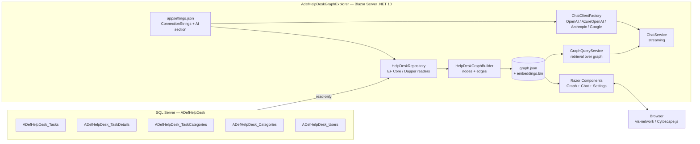
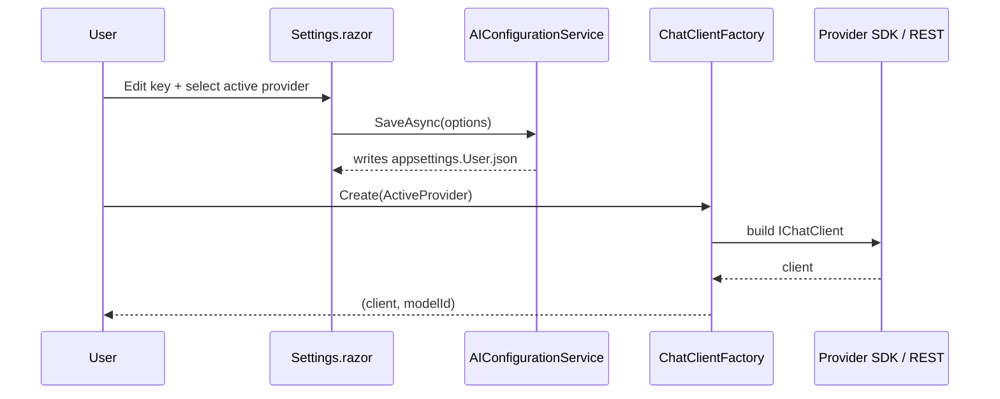
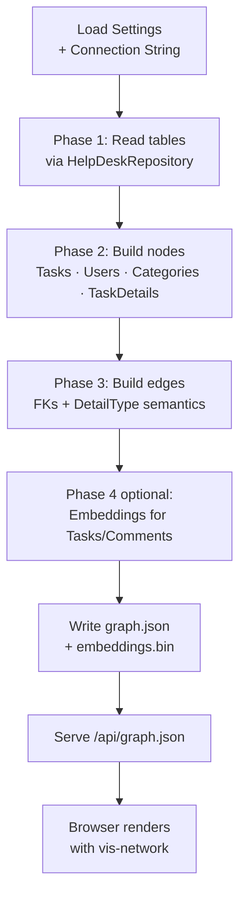
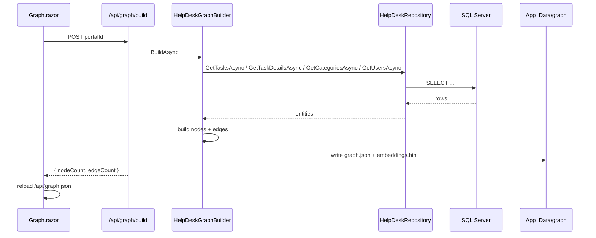
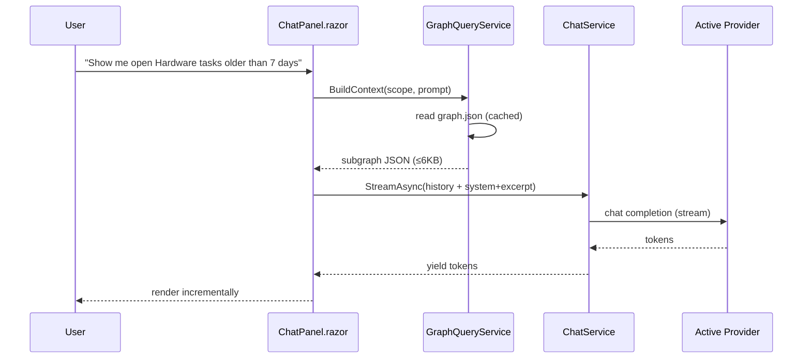

# AdefHelpDeskGraphExplorer — Implementation Plan

This document is the engineering plan for turning **AdefHelpDeskGraphExplorer** (currently an empty Blazor Server scaffold targeting .NET 10) into a tool that:

1. Connects to one of four AI providers (**OpenAI**, **Azure OpenAI**, **Anthropic**, **Google**) — modeled on `SimpleChat`.
2. Reads the existing **ADefHelpDesk** SQL Server database directly (connection string in `appsettings.json`).
3. Parses Tasks / TaskDetails / Comments / Categories / Users into a **`graph.json`** artifact — modeled on `StoryParserProofOfConcept`.
4. Renders an interactive **JavaScript graph visualizer** in the browser.
5. Offers a **Chat** experience that answers questions grounded in the help-desk graph.

A developer should be able to start coding from this document alone.

---

## 1. High-Level Architecture



Runtime is a single Blazor Server process. `graph.json` is built on demand from the live database and cached on disk under the content root.

---

## 2. Feature #1 — AI Provider Configuration (port of `SimpleChat`)

### 2.1 Options model

Add `Models/AIOptions.cs` mirroring `SimpleChat`:

```csharp
public sealed class AIOptions
{
    public const string SectionName = "AI";
    public string ActiveProvider { get; set; } = "OpenAI";
    public Dictionary<string, ProviderOptions> Providers { get; set; } = new();
    public ChatDefaults Defaults { get; set; } = new();
}

public sealed class ProviderOptions
{
    public bool Enabled { get; set; }
    public string? ApiKey { get; set; }
    public string? Endpoint { get; set; }
    public string? DefaultModel { get; set; }
    public string? DeploymentName { get; set; } // Azure
    public string? ApiVersion { get; set; }     // Azure
    public List<string> Models { get; set; } = new();
}

public sealed class ChatDefaults
{
    public float Temperature { get; set; } = 0.7f;
    public int MaxOutputTokens { get; set; } = 1024;
    public string SystemPrompt { get; set; } = "You are a help-desk analytics assistant.";
}
```

### 2.2 `appsettings.json` additions

```jsonc
{
  "ConnectionStrings": {
    "ADefHelpDesk": "Server=localhost;Database=ADefHelpDesk;Trusted_Connection=True;TrustServerCertificate=True"
  },
  "AI": {
    "ActiveProvider": "OpenAI",
    "Providers": {
      "OpenAI":      { "Enabled": true,  "ApiKey": "", "Endpoint": "https://api.openai.com/v1",            "DefaultModel": "gpt-4o-mini",            "Models": ["gpt-4o-mini","gpt-4o"] },
      "AzureOpenAI": { "Enabled": false, "ApiKey": "", "Endpoint": "",                                     "DeploymentName": "",                    "ApiVersion": "2024-10-21", "Models": ["gpt-4o","gpt-4o-mini"] },
      "Anthropic":   { "Enabled": false, "ApiKey": "", "Endpoint": "https://api.anthropic.com",            "DefaultModel": "claude-sonnet-4-20250514","Models": ["claude-sonnet-4-20250514"] },
      "GoogleAI":    { "Enabled": false, "ApiKey": "", "Endpoint": "https://generativelanguage.googleapis.com","DefaultModel": "gemini-2.5-flash",  "Models": ["gemini-2.5-flash","gemini-2.5-pro"] }
    },
    "Defaults": { "Temperature": 0.7, "MaxOutputTokens": 1024, "SystemPrompt": "You are a help-desk analytics assistant." }
  }
}
```

A writable overlay file `appsettings.User.json` (git-ignored) is loaded with `optional: true, reloadOnChange: true` so the Settings page can persist edits without touching `appsettings.json`.

### 2.3 Services to port

| File (new) | Source in SimpleChat | Notes |
|---|---|---|
| `Services/AI/AIConfigurationService.cs` | same | Read/write provider settings; persists to `appsettings.User.json`. |
| `Services/AI/ChatClientFactory.cs` | same | Switch on `ActiveProvider` -> returns `IChatClient` + model id. |
| `Services/AI/ChatService.cs` | same | `IAsyncEnumerable<string> StreamAsync(history, provider?, model?, ct)`. |
| `Services/AI/AnthropicChatClient.cs` | same | REST adapter (`Microsoft.Extensions.AI.IChatClient`). |
| `Services/AI/GoogleAIChatClient.cs` | same | REST adapter. |
| `Services/AI/AIModelService.cs` | same | Lists models per provider for the Settings page. |
| `Services/AI/AICapabilities.cs` | same | Gates temperature for reasoning / Anthropic models. |

NuGet packages: `Microsoft.Extensions.AI`, `OpenAI`, `Azure.AI.OpenAI`, `Azure.Identity` (optional for AAD), `Microsoft.Extensions.Http`.

### 2.4 Registration in `Program.cs`

```csharp
builder.Configuration.AddJsonFile("appsettings.User.json", optional: true, reloadOnChange: true);

builder.Services.AddOptions<AIOptions>().Bind(builder.Configuration.GetSection(AIOptions.SectionName));
builder.Services.AddSingleton<AIConfigurationService>();
builder.Services.AddSingleton<ChatClientFactory>();
builder.Services.AddHttpClient();
builder.Services.AddHttpClient<AIModelService>();
builder.Services.AddScoped<ChatService>();
```

### 2.5 Settings UI

`Components/Pages/Settings.razor` — port from SimpleChat:

- Tabs per provider, fields for `ApiKey`, `Endpoint`, `DefaultModel`/`DeploymentName`, `Enabled`, `Models`.
- "Test Access" button → `ChatService.TestAccessAsync(provider)`.
- "Save" calls `AIConfigurationService.SaveAsync()` which writes the user overlay.

### 2.6 Provider selection flow



---

## 3. Feature #3 — Configurable Database Connection

### 3.1 `appsettings.json`

`ConnectionStrings:ADefHelpDesk` is the single source of truth. The Settings page exposes a read/write field for it; saving writes through `AIConfigurationService` (rename to `AppConfigurationService`) into `appsettings.User.json`.

### 3.2 EF Core read-only context

Add `Microsoft.EntityFrameworkCore.SqlServer`. Create `Data/HelpDeskDbContext.cs` containing **only the entities we need**:

| Entity | Table | Notable columns |
|---|---|---|
| `HdTask` | `ADefHelpDesk_Tasks` | `TaskID`, `PortalID`, `Description`, `Status`, `Priority`, `CreatedDate`, `DueDate`, `AssignedRoleID`, `RequesterUserID`, `RequesterName`, `RequesterEmail` |
| `HdTaskDetail` | `ADefHelpDesk_TaskDetails` | `DetailID`, `TaskID`, `DetailType`, `InsertDate`, `UserID`, `Description`, `StartTime`, `StopTime` |
| `HdTaskCategory` | `ADefHelpDesk_TaskCategories` | `ID`, `TaskID`, `CategoryID` |
| `HdCategory` | `ADefHelpDesk_Categories` | `CategoryID`, `PortalID`, `ParentCategoryID`, `CategoryName`, `Level` |
| `HdUser` | `ADefHelpDesk_Users` | `UserID`, `Username`, `FirstName`, `LastName`, `Email`, `IsSuperUser` |

`DetailType` values observed in ADefHelpDesk: `Description`, `Comment`, `TimeEntry`, `Resolution`, `Status` (treat as enum-by-string; **Comments** = rows with `DetailType = 'Comment'`).

Register read-only:

```csharp
builder.Services.AddDbContext<HelpDeskDbContext>((sp, o) =>
{
    var cs = sp.GetRequiredService<IConfiguration>().GetConnectionString("ADefHelpDesk");
    o.UseSqlServer(cs).UseQueryTrackingBehavior(QueryTrackingBehavior.NoTracking);
});
```

A `HelpDeskRepository` exposes async methods: `GetTasksAsync(portalId, since)`, `GetTaskDetailsAsync(taskIds)`, `GetCategoriesAsync(portalId)`, `GetUsersAsync(userIds)`.

### 3.3 Connection validation

`Services/HelpDesk/ConnectionTester.cs` — runs `SELECT TOP 1 TaskID FROM ADefHelpDesk_Tasks`. Wired to a "Test connection" button in Settings.

---

## 4. Feature #2 + #4 — Graph Build & Visualizer

### 4.1 Pipeline (mirrors `ManuscriptParsingService`)



Working directory: `ContentRoot/App_Data/graph/` (created on first build). Files:

- `graph.json` — full node/edge document.
- `embeddings.bin` — packed `float[]` (binary, one row per chunk), index file `embeddings.index.json` mapping `{ nodeId, offset, length }`. Same compact format used by `ManuscriptParsingService.SaveEmbeddingAsync`.
- `log-YYYYMMDD.txt` — build log (ported `LogService`).

### 4.2 `graph.json` schema

```jsonc
{
  "version": 1,
  "generatedUtc": "2026-05-11T12:00:00Z",
  "portalId": 0,
  "nodes": [
    { "id": "task:42",      "type": "Task",        "label": "Printer offline", "data": { "status": "Open", "priority": "High", "createdUtc": "...", "dueUtc": "...", "requesterUserId": 7 } },
    { "id": "detail:910",   "type": "TaskDetail",  "label": "Resolution",      "data": { "taskId": 42, "detailType": "Resolution", "userId": 3, "insertedUtc": "...", "text": "..." } },
    { "id": "comment:912",  "type": "Comment",     "label": "Comment",         "data": { "taskId": 42, "userId": 7, "insertedUtc": "...", "text": "..." } },
    { "id": "user:7",       "type": "User",        "label": "Jane Doe",        "data": { "email": "jane@x.com", "isSuperUser": false } },
    { "id": "category:5",   "type": "Category",    "label": "Hardware",        "data": { "parentCategoryId": null, "level": 0 } }
  ],
  "edges": [
    { "id": "e1", "source": "task:42",    "target": "user:7",     "type": "REQUESTED_BY" },
    { "id": "e2", "source": "task:42",    "target": "category:5", "type": "IN_CATEGORY" },
    { "id": "e3", "source": "task:42",    "target": "detail:910", "type": "HAS_DETAIL" },
    { "id": "e4", "source": "task:42",    "target": "comment:912","type": "HAS_COMMENT" },
    { "id": "e5", "source": "user:3",     "target": "detail:910", "type": "AUTHORED" },
    { "id": "e6", "source": "category:5", "target": "category:1", "type": "CHILD_OF" }
  ]
}
```

Comments are a logical node type built from `ADefHelpDesk_TaskDetails WHERE DetailType = 'Comment'`. Other detail types become `TaskDetail` nodes carrying `detailType` in `data`.

### 4.3 Node / edge derivation rules

| Source row | Node produced | Edges produced |
|---|---|---|
| `ADefHelpDesk_Tasks` | `task:{TaskID}` | `task → user:{RequesterUserID}` `REQUESTED_BY` |
| `ADefHelpDesk_TaskCategories` | – | `task:{TaskID} → category:{CategoryID}` `IN_CATEGORY` |
| `ADefHelpDesk_Categories` | `category:{CategoryID}` | If `ParentCategoryID` not null: `category → category` `CHILD_OF` |
| `ADefHelpDesk_TaskDetails` (DetailType ≠ 'Comment') | `detail:{DetailID}` | `task → detail` `HAS_DETAIL`; `user:{UserID} → detail` `AUTHORED` |
| `ADefHelpDesk_TaskDetails` (DetailType = 'Comment') | `comment:{DetailID}` | `task → comment` `HAS_COMMENT`; `user → comment` `AUTHORED` |
| `ADefHelpDesk_Users` | `user:{UserID}` | – |

`TaskDetailsType` enum (string-valued): `Description`, `Comment`, `TimeEntry`, `Resolution`, `Status`, `Other`.

### 4.4 Builder service

```csharp
public interface IHelpDeskGraphBuilder
{
    Task<GraphDocument> BuildAsync(int portalId, IProgress<int>? progress, CancellationToken ct);
    Task SaveAsync(GraphDocument doc, string outputDir, CancellationToken ct);
}
```

Implementation `HelpDeskGraphBuilder` in `Services/Graph/`. Steps:

1. Pull rows via `HelpDeskRepository` (bounded by `PortalID` + optional `since` date).
2. Build dictionaries keyed by composite ids to avoid duplicates.
3. Emit nodes then edges; never reference a missing node.
4. Serialize with `JsonSerializerOptions { WriteIndented = true, PropertyNamingPolicy = JsonNamingPolicy.CamelCase }`.
5. (Optional) Generate embeddings for `task.label + first 500 chars`, `comment.text`, `detail.text` using the active AI provider's embedding model (or skip if not configured). Persist in `embeddings.bin`.

### 4.5 API surface

Minimal endpoints under `Program.cs`:

```csharp
app.MapGet("/api/graph.json", (GraphCache cache) => Results.File(cache.GraphJsonPath, "application/json"));
app.MapPost("/api/graph/build", async (int portalId, IHelpDeskGraphBuilder b, GraphCache cache, CancellationToken ct) =>
{
    var doc = await b.BuildAsync(portalId, progress: null, ct);
    await b.SaveAsync(doc, cache.OutputDir, ct);
    return Results.Ok(new { doc.Nodes.Count, doc.Edges.Count });
});
```

### 4.6 JavaScript visualizer

Use **vis-network** (lightweight, MIT, no build step). Add via CDN in `Components/App.razor` or vendor into `wwwroot/lib/vis-network/`.

`wwwroot/js/graph-view.js`:

```js
export async function render(containerId) {
  const res = await fetch('/api/graph.json');
  const g = await res.json();
  const nodes = new vis.DataSet(g.nodes.map(n => ({
    id: n.id, label: n.label, group: n.type, title: JSON.stringify(n.data, null, 2)
  })));
  const edges = new vis.DataSet(g.edges.map(e => ({
    id: e.id, from: e.source, to: e.target, label: e.type, arrows: 'to'
  })));
  const network = new vis.Network(document.getElementById(containerId),
    { nodes, edges },
    { physics: { stabilization: true }, groups: {
        Task:      { color: '#4e79a7' },
        TaskDetail:{ color: '#f28e2b' },
        Comment:   { color: '#e15759' },
        User:      { color: '#76b7b2' },
        Category:  { color: '#59a14f' }
    }});
  network.on('selectNode', p => DotNet.invokeMethodAsync('AdefHelpDeskGraphExplorer', 'OnNodeSelected', p.nodes[0]));
  return network;
}
```

`Components/Pages/Graph.razor`:

- Toolbar: "Rebuild graph", filter by type/status/category, search box.
- `<div id="graph" style="height: 80vh"></div>`.
- `OnAfterRenderAsync(firstRender)` → `JS.InvokeAsync("graphView.render", "graph")`.
- `[JSInvokable] OnNodeSelected(string id)` → fetches full node payload and pushes it into the side panel (and into the Chat page as context).

### 4.7 Graph build flow



---

## 5. Feature #2 (continued) — Chat over the Graph

### 5.1 Retrieval strategy

`Services/Graph/GraphQueryService.cs` provides two retrieval modes used to build the chat context:

1. **Structured**: keyword + filter (`status`, `priority`, `category`, `assignedRoleId`) → returns matching task subgraphs (task + its details/comments + requester + categories).
2. **Vector** (when embeddings exist): cosine similarity over `embeddings.bin`, returning top‑K node ids; expanded to their 1‑hop neighborhood.

### 5.2 Prompting

System prompt template:

```
You are a help-desk analytics assistant. Answer using only the supplied JSON
graph excerpt. Cite task IDs as #<TaskID>. If the answer is not in the graph,
say so. Excerpt:
<<<
{graphExcerptJson}
>>>
```

The graph excerpt is the subgraph from `GraphQueryService`, capped at ~30 nodes / ~6 KB. The user message is appended verbatim. Streaming output reuses `ChatService.StreamAsync`.

### 5.3 Chat UI

Port `Components/Chat/*` from SimpleChat (`ChatPanel`, `MessageList`, `MessageBubble`, `MessageInput`). Add a top selector for **Scope**: *All tasks*, *Selected node*, *Filter…* — bound to `GraphQueryService` parameters.

### 5.4 Chat sequence



---

## 6. Project Layout (final)

```
AdefHelpDeskGraphExplorer/
├── Program.cs
├── appsettings.json
├── appsettings.User.json        (gitignored, runtime-written)
├── Components/
│   ├── App.razor
│   ├── Routes.razor
│   ├── Layout/ (existing)
│   ├── Pages/
│   │   ├── Home.razor
│   │   ├── Graph.razor          (new)
│   │   ├── Chat.razor           (new)
│   │   └── Settings.razor       (new)
│   └── Chat/                    (new — ported from SimpleChat)
├── Models/
│   ├── AIOptions.cs
│   ├── ChatMessage.cs
│   ├── Graph/
│   │   ├── GraphDocument.cs
│   │   ├── GraphNode.cs
│   │   └── GraphEdge.cs
│   └── HelpDesk/                (POCOs for the 5 tables)
├── Data/
│   ├── HelpDeskDbContext.cs
│   └── HelpDeskRepository.cs
├── Services/
│   ├── AI/                      (ported from SimpleChat)
│   ├── Graph/
│   │   ├── IHelpDeskGraphBuilder.cs
│   │   ├── HelpDeskGraphBuilder.cs
│   │   ├── GraphCache.cs
│   │   └── GraphQueryService.cs
│   └── HelpDesk/
│       └── ConnectionTester.cs
├── wwwroot/
│   ├── js/graph-view.js         (new)
│   └── lib/vis-network/         (new — vendored or CDN)
└── docs/
    └── implementation-plan.md   (this file)
```

---

## 7. NuGet & Front-End Dependencies

| Purpose | Package |
|---|---|
| EF Core SQL Server | `Microsoft.EntityFrameworkCore.SqlServer` |
| Chat abstraction | `Microsoft.Extensions.AI` |
| OpenAI | `OpenAI` |
| Azure OpenAI | `Azure.AI.OpenAI` |
| HTTP clients | `Microsoft.Extensions.Http` |
| (Optional) JSON helpers | none — use `System.Text.Json` |
| UI components | `Radzen.Blazor` (matches SimpleChat) |
| Graph visualizer | `vis-network` (CDN: `https://unpkg.com/vis-network/standalone/umd/vis-network.min.js`) |

---

## 8. Configuration Cheat Sheet

`appsettings.json` (final shape):

```jsonc
{
  "ConnectionStrings": {
    "ADefHelpDesk": "Server=localhost;Database=ADefHelpDesk;Trusted_Connection=True;TrustServerCertificate=True"
  },
  "Graph": {
    "PortalID": 0,
    "OutputDirectory": "App_Data/graph",
    "GenerateEmbeddings": false
  },
  "AI": { /* see §2.2 */ }
}
```

---

## 9. Build Order (suggested)

1. **Bootstrap**: add NuGet refs, `AIOptions`, `appsettings.User.json` overlay, blank Settings page.
2. **AI port**: copy `Services/AI/*` and `Components/Chat/*` from SimpleChat, get "Test Access" green for at least one provider.
3. **Database layer**: connection string field in Settings, `HelpDeskDbContext`, `HelpDeskRepository`, "Test connection" button.
4. **Graph build**: `HelpDeskGraphBuilder` + `/api/graph/build` + `/api/graph.json`; verify `graph.json` on disk.
5. **Visualizer**: `Graph.razor` + `wwwroot/js/graph-view.js` with vis-network.
6. **Chat over graph**: `GraphQueryService`, wire `Chat.razor` to use it as system context.
7. **Optional**: embeddings + vector retrieval.

---

## 10. Risks & Mitigations

| Risk | Mitigation |
|---|---|
| `graph.json` too large for large databases | Filter by `PortalID`, date window, and node-type toggles before building. Stream JSON if > 10 MB. |
| Secrets in `appsettings.json` | Settings page writes only to `appsettings.User.json` which is in `.gitignore`. Recommend user secrets / Key Vault for prod. |
| Provider API churn | All provider-specific code is isolated behind `IChatClient` (Microsoft.Extensions.AI), matching SimpleChat's pattern. |
| SQL injection / write access | Use EF Core parameterized queries and run with a SQL login restricted to `SELECT` on the five tables. |
| Hallucinated task IDs in chat | System prompt restricts answers to supplied excerpt; UI renders `#<TaskID>` as a link only when the id is present in the excerpt. |

